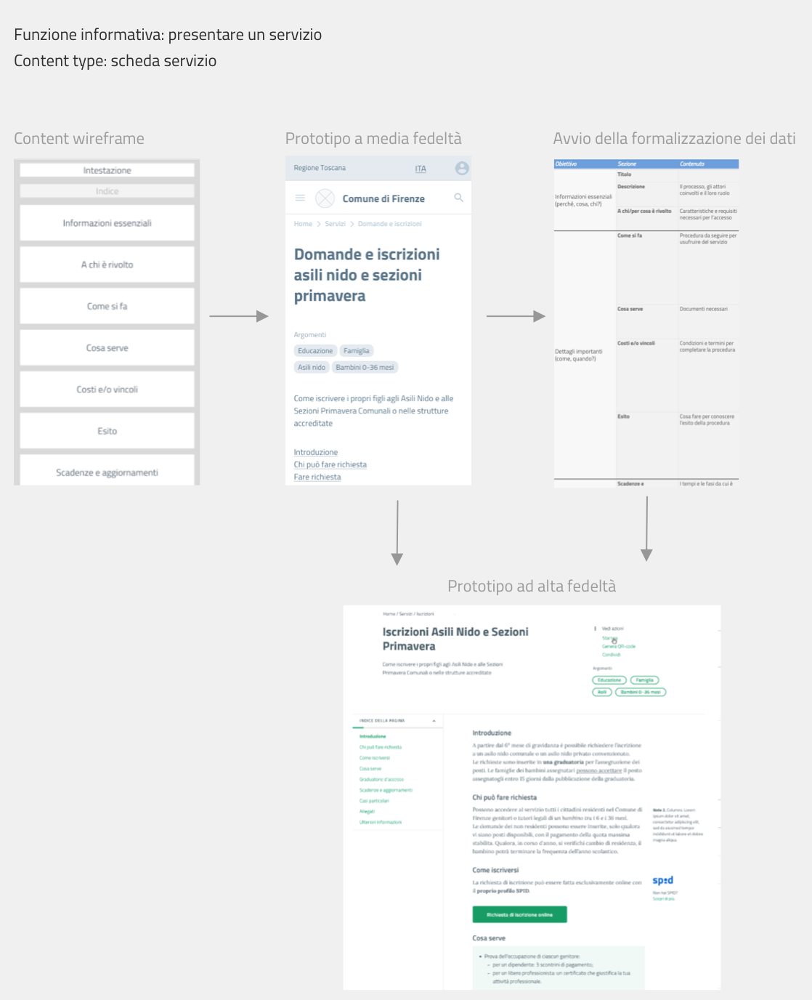
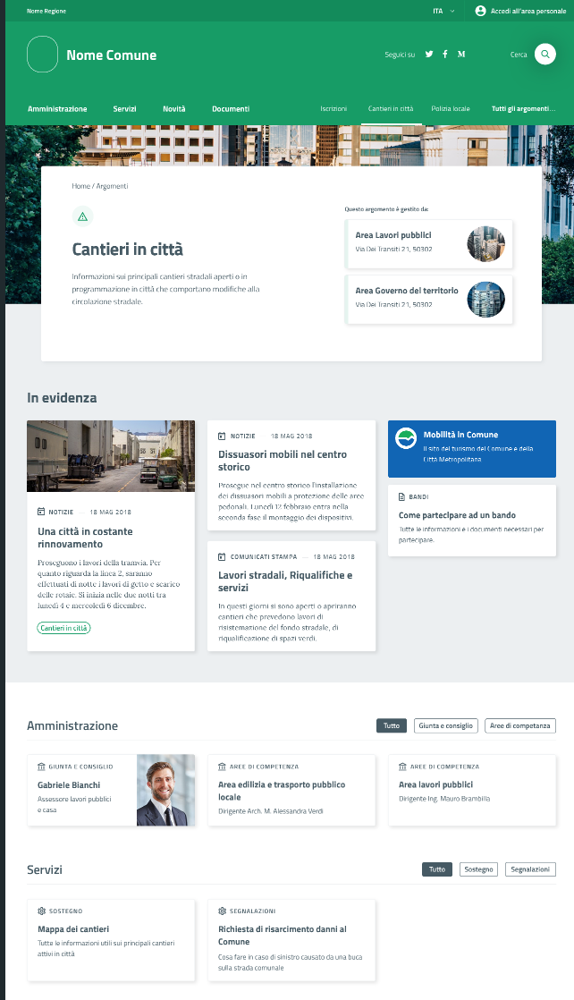
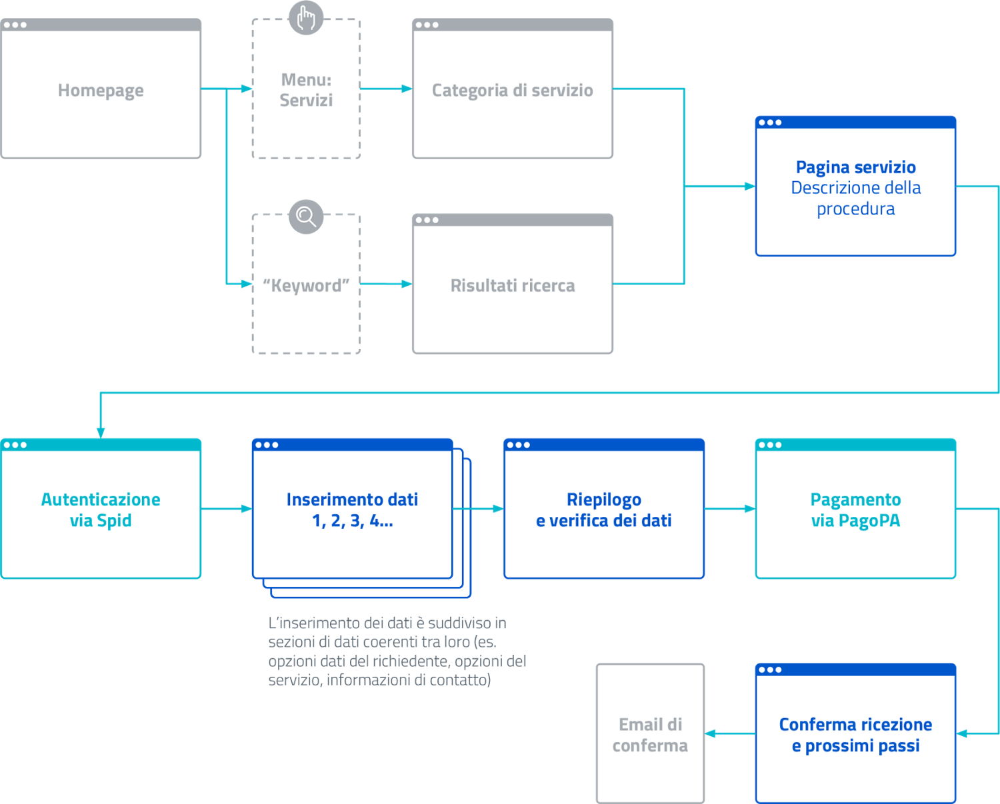
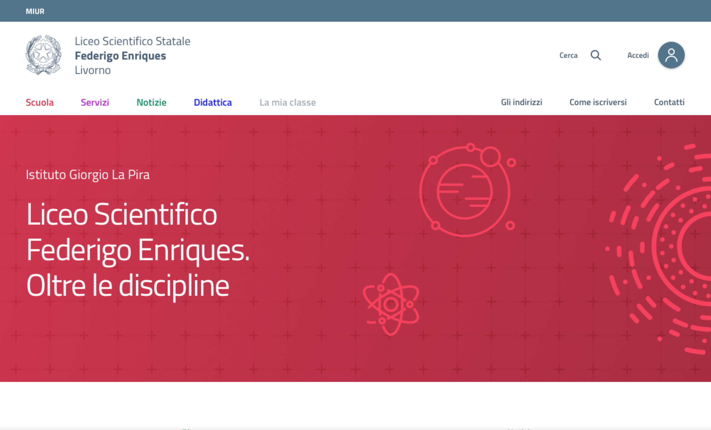

Architettura dell’informazione
------------------------------

.. include:: /banner.rst

L’architettura dell’informazione consiste nell’organizzazione semantica e logica di ambienti informativi, sia fisici sia digitali, e serve a rendere i servizi pubblici più facili da trovare, da capire e da usare. Una buona architettura dell’informazione aiuta le persone a comprendere ciò che le circonda e a trovare ciò che cercano, sia online che offline. Lavorare su questo ambito implica una riflessione sulla struttura dell’informazione e sul linguaggio. L’architettura dell’informazione è più efficace se è progettata intorno ai reali bisogni delle persone: per questo si parla di *user-centered design*.

Obiettivo del paragrafo è offrire indicazioni pratiche relative alla progettazione dei sistemi di navigazione, delle tipologie di contenuti (*content type*), dei flussi di interazione con l’utente e alla modellazione dei contenuti (per esempio attraverso ontologie e vocabolari controllati).  

La progettazione di un ambiente informativo può partire dalla definizione delle funzioni di base svolte tipicamente dalla Pubblica Amministrazione nei confronti di cittadini e imprese. Possiamo elencarne alcune: 

- lo scambio di denaro (per esempio quando si deve pagare una multa o ricevere la pensione); 
- l’iscrizione a qualcosa (per esempio quando si deve scegliere la scuola per proprio figlio); 
- la prenotazione di un appuntamento (per esempio quando si deve prenotare una visita medica); 
- l’offerta di lavoro o di progetti  (per esempio quando si partecipa a un concorso o a un bando); 
- l’informazione sull’attività amministrativa (ad esempio quando si pubblica una notizia o un evento);
- la regolamentazione della vita dei cittadini (ad esempio attraverso leggi o decreti attuativi);
- la certificazione di qualcosa o l’autorizzazione a fare qualcosa (come nel caso di un cambio di residenza o del rilascio di un passaporto).

Contenuti, persone e contesto
~~~~~~~~~~~~~~~~~~~~~~~~~~~~~~~~
Progettare l’architettura dell’informazione significa soddisfare i bisogni degli utenti, creando e organizzando l’informazione per dare senso alle cose, nel rispetto del contesto organizzativo e di fruizione dei servizi.

.. figure:: images/diagramma_ai.png
   :alt: Architettura dell’informazione
   :align: center

   Architettura dell’informazione
   
L’analisi delle esigenze informative e dei comportamenti di navigazione degli utenti contribuisce alla progettazione di una efficace architettura dell’informazione. Per analizzare il tipo di pubblico del sito web è necessario definire:
- i profili di utenti a cui si rivolge l’informazione o il servizio
- i bisogni, ovvero le necessità informative e operative degli utenti

È bene prendere decisioni sulla base dell’analisi dei dati riferiti all’utente in particolare: 
- i dati statistici di navigazione sul sito per comprendere il comportamento dell’utente 
- la realizzazione di interviste e test di usabilità per comprendere  l’esperienza e la competenza generale di navigazione dell’utente target.

Per un approfondimento sui metodi di ricerca sugli utenti vai alla `sezione dedicata alla user research. <../../doc/user-research.html>`_

La seconda area rilevante per l’architettura dell’informazione è quella relativa ai contenuti. Per **contenuto** si intendono le informazioni di tipo non strutturato (testi, immagini, video) o strutturato (dati e metadati) veicolate da pagine web, documenti, applicazioni grazie alle quali la Pubblica Amministrazione offre i propri servizi ai cittadini. 
Il content journey è uno strumento adatto per fare una mappa preliminare dei bisogni informativi degli utenti: un modello è disponibile all’interno del `kit per la progettazione dei contenuti. <https://designers.italia.it/kit/content-kit/>`_ La mappatura delle informazioni esistenti e rilevanti per progettare un servizio può essere fatta attraverso un’attività di `content inventory <../content-design/linguaggio.html#scrivere-e-riscrivere>`_ e la loro formalizzazione può avvenire attraverso `ontologie e vocabolari controllati <../content-design/architettura-dell-informazione.html#ontologie-e-standard>`_. Spesso l’esito di questa analisi determina quella che viene definita una gap analysis, che evidenzia i contenuti e i dati presenti attualmente sul sito e quelli che dovranno essere prodotti, modificati o eliminati nella nuova versione del servizio. 

Per un approfondimento su dati e metadati vai alle `linee guida per i cataloghi dati. <https://docs.italia.it/italia/daf/linee-guida-cataloghi-dati-dcat-ap-it/it/stabile/index.html>`_

Per un approfondimento sui contenuti non strutturati vai alla `sezione dedicata al linguaggio. <../content-design/linguaggio.html#scrivere-e-riscrivere>`_

Nella progettazione di un sito web, l’architettura dell’informazione deve necessariamente adattarsi al **contesto** di riferimento, per essere coerente con gli obiettivi, la strategia e la cultura dell’organizzazione. Per analizzare il contesto è necessario quindi considerare e definire:

- gli obiettivi strategici dell’Amministrazione
- le risorse economiche disponibili
- le direttive/norme vigenti che vincolano il progetto
- la cultura dell’amministrazione, intesa anche come la propensione al cambiamento
- l’ambito tecnologico e gli standard esistenti per la Pubblica Amministrazione
- le risorse umane coinvolte nel progetto, e le loro competenze tecniche
- i limiti operativi, relativi ad esempio alla logistica, alla sicurezza

Per approfondire, vai alla sezione dedicata al `design di un servizio <../../doc/service-design.html>`_ e utilizza la `ecosystem map. <https://designers.italia.it/kit/ecosystem-map/>`_

Definizione e organizzazione dei contenuti
~~~~~~~~~~~~~~~~~~~~~~~~~~~~~~~~~~~~~~~~~~
Uno dei principi dell’architettura dell’informazione è tenere conto del contesto e delle funzioni delle organizzazioni e dei servizi che esprimono. Questo significa che è possibile definire, come vedremo, standard di architettura dell’informazione specifici per il mondo della Pubblica Amministrazione. In secondo luogo, sarà possibile avviare un’attività di modellazione più specifica, partendo da una segmentazione degli enti e delle funzioni ad esse associate. In pratica, l’organizzazione della conoscenza all’interno della Pubblica Amministrazione ha alcune regole generali che è bene conoscere e che devono essere utilizzate in ogni ambito; e alcune regole (standard) che si possono applicare all’interno di ambiti specifici. Per fare un esempio, è possibile definire uno standard per l’architettura dell’informazione dei Comuni italiani, senza che sia necessario affrontare il problema per ciascuno dei migliaia dei siti web dei Comuni italiani. L’utilizzo di standard nella definizione di contenuti, dati e nella loro classificazione è alla base di concetti come l’interoperabilità e in definitiva rappresenta la creazione di un linguaggio digitale comune alla Pubblica Amministrazione italiana. L’ architettura dell’informazione partecipa alla fase di  `progettazione e prototipazione di un sito o di un servizio digitale <../../doc/prototyping.html>`_ attraverso strumenti come il `wireframe kit <https://designers.italia.it/kit/wireframe-kit/>`_ (che contiene modelli di content type e pattern di interazione) e il `kit per la definizione dei sistemi di navigazione e dei modelli di contenuto di un sito <https://designers.italia.it/kit/information-architecture/>`_

I content type
==============

In fase di progettazione, i contenuti di un sito web devono essere organizzati in diverse tipologie, o content type. Esempi di content type sono una scheda di presentazione di un servizio, una form per inserire dati anagrafici, una notizia o una scheda di presentazione di un evento. Sulla base delle funzioni che deve svolgere un sito, è possibile definire una lista dei content type. Vediamone alcuni.

+-----------------------------------+-----------------------------------+
| **Esempi di content type**        | **Funzioni principali**           |
+===================================+===================================+
| Scheda unità organizzativa        | Descrive una unità organizzativa  |
|                                   | come un ufficio o una funzione    |
|                                   | politica, definendone le          |
|                                   | caratteristiche, gli obiettivi e  |
|                                   | le persone che ne fanno parte     |
+-----------------------------------+-----------------------------------+
| Scheda luogo                      | Descrive un luogo rilevante per   |
|                                   | la Pubblica Amministrazione e gli |
|                                   | utenti a cui si rivolge,          |
|                                   | definendone le coordinate         |
|                                   | geografiche e altri aspetti come  |
|                                   | le modalità di accesso da parte   |
|                                   | dei cittadini                     |
+-----------------------------------+-----------------------------------+
| Evento                            | Descrive un evento, definendone   |
|                                   | le caratteristiche, il luogo e le |
|                                   | date e dando la possibilità di    |
|                                   | rappresentarlo attraverso una     |
|                                   | mappa e un calendario             |
+-----------------------------------+-----------------------------------+
| Notizia                           | Descrive un evento, definendone   |
|                                   | le caratteristiche, il luogo e le |
|                                   | date e dando la possibilità di    |
|                                   | rappresentarlo attraverso una     |
|                                   | mappa e un calendario             |
+-----------------------------------+-----------------------------------+
| Scheda servizio                   | Descrive il servizio e fa capire  |
|                                   | all’utente come utilizzarlo,      |
|                                   | nella sua forma tradizionale e/o  |
|                                   | digitale                          |
+-----------------------------------+-----------------------------------+

In una fase iniziale di progettazione, per ciascuno dei content type occorre riportare le caratteristiche essenziali ad avviare il processo di prototipazione. Successivamente si procederà a definire i dettagli della struttura dati e a una progressiva evoluzione del prototipo (comprensivo delle funzioni di front-end e di back-end) come riportato in figura. 

I sistemi di navigazione
========================
Un sito web presenta abitualmente **un sistema di navigazione principale** (menù di navigazione), che a sua volta può essere organizzato in uno o più livelli e che genera il menù di navigazione di un sito web. La struttura di navigazione può essere riprodotta anche attraverso la creazione di breadcrumb, normalmente posizionati nella parte alta di ciascuna delle pagine web di cui si compone il sito. Ad esempio, nella pagina dedicata all’ufficio anagrafe di un sito web di un Comune potremmo trovare il breadcrumb *Amministrazione/Uffici/Ufficio anagrafe.*

La struttura di navigazione di base aiuta l’utente ad orientarsi e a comprendere rapidamente l’organizzazione delle informazioni presenti sul sito. 

Accanto al sistema di navigazione primario, esistono **diversi altri sistemi per connettere contenuti**, costruire percorsi di navigazione e permettere agli utenti di raggiungere i promo scopi. Ad esempio, in un sito che ha una sezione dedicata agli eventi gli eventi vengono classificati definendone le coordinate geografiche e il periodo temporale, e questo rende possibile offrire una rappresentazione mediante mappe e calendari. Allo stesso modo, se si definisce un vocabolario controllato di argomenti che interessano agli utenti di un Comune (es. casa) e si classificano tutti i contenuti usando questi argomenti, sarà possibile generare liste di contenuti che condividono questa proprietà e, in definitiva, facilitare la navigazione e la ricerca per gli utenti. 

   *Pagina standard per il sito di un Comune che raggruppa tutti i contenuti del sito che condividono l’etichetta “Cantieri”*

Un altro caso tipico di relazione tra contenuti è quella relativa ai **flussi di fruizione di un servizio web**. Prendiamo ad esempio il servizio che abilita il pagamento di una multa. Attraverso una serie di passaggi **sequenziali** l’utente sarà condotto dalla login a un documento (la multa) e da qui a una form che consente l’inserimento dei dati di pagamento.

   *Rappresentazione del flusso di fruizione di un servizio digitale: percorso di navigazione e relazioni tra contenuti.*

Home page, pagine di ricerca e aree personali
=============================================
Home page, pagine di ricerca e aree personali sono tre punti di ingresso chiave per comprendere e accedere al sistema.
La **home page** di un sito ha la funzione di punto di ingresso, ed è tipicamente il luogo in cui l’utente ottiene una visione chiara della missione di un sito e delle sue funzioni chiave. Un modo semplice per organizzare la home page è definire una struttura coerente rispetto al sistema di navigazione principale, per esempio attraverso un layout a fasce.

+-----------------------+
| Header                |
|                       | 
+-----------------------+
| Apertura (descrive la |                      
| funzione principale   |
| del sito, o           |                       
| “missione”)           |                     
+-----------------------+
| Sezione 1             |                    
|                       |                       
| Riporta contenuti     |                     
| rilevanti contenuti   |                     
| nella sezione e       |                    
| consente accesso agli |                      
| altri                 |                       
+-----------------------+
| Sezione 2             |                 
|                       |                   
| Riporta contenuti     |                     
| rilevanti contenuti   |        
| nella sezione e       |                    
| consente accesso agli |                       
| altri                 |                      
+-----------------------+
| Sezione 3             |                      
|                       |                      
| Riporta contenuti     |                    
| rilevanti contenuti   |                    
| nella sezione e       |
| consente accesso agli |                     
| altri                 |                    
+-----------------------+
| ...                   |
+-----------------------+
| Footer                |               
+-----------------------+

*Modello di home page di un sito web organizzato in quattro sezioni principali e prototipo della home page di un sito scolastico che segue questo approccio*

   
   
I siti web che offrono servizi digitali ai cittadini mettono a disposizione **un’area personale dell’utente** a cui si accede mediante credenziali di accesso (per esempio Spid) e che possiede un proprio sistema di navigazione contestuale. In termini generali, l’area personale serve a gestire l’interazione di un utente con il sistema. 
Un modo semplice per organizzare un’area personale è prevedere un’area messaggi, un’area che mostra la lista delle procedure in corso dei servizi attivati e un’area destinata ad archiviare l’esito delle azioni compiute in passato (es. lista dei pagamenti, dei documenti ricevuti, delle iscrizioni fatte).

+-----------------------+-----------------------+-----------------------+
| messaggi              | Servizi               | Documenti e pagamenti |
|                       |                       |                       |
|                       | -  disponibili        | -  lista pagamenti    |
|                       |                       |                       |
|                       | -  in corso di        | -  lista documenti e  |
|                       |    attivazione        |    certificati        |
|                       |                       |    ottenuti           |
|                       | -  attivi             |                       |
+-----------------------+-----------------------+-----------------------+

Il **motore di ricerca** ha il compito di fornire liste di risultati corrispondenti alle ricerche formulate dall’utente cercando tra i testi del sito e/o utilizzando i sistemi di classificazione (come ad esempio categorie e tag) del sistema. 

Partendo dal testo che l’utente ha iniziato a generare, la funzione di *autocompletamento* permette di indirizzare l’utente, suggerendo possibili ricerche. Il filtering è il processo di raggruppamento dei contenuti di un sito in sottoinsiemi più piccoli, lavorando su una o più dimensioni semantiche contemporaneamente (filtri multipli). Se abbiamo ben strutturato i contenuti, saremo in grado di proporre all’utente la possibilità di usare dei filtri (per categorie, per tipologia di contenuto, per autore, per data…) per raffinare progressivamente la ricerca e raggiungere il risultato.  Se ben strutturati, i sistemi di *filtering* possono svolgere la funzione di un sistema di navigazione, aiutando l’utente a prendere consapevolezza dell’ambiente informativo in cui si muove, di ciò che può trovare e di quali sono le migliori strategie per trovarlo. 

Il *sorting* è il criterio di ordinamento dei risultati di ricerca. Per esempio, un utente che intende trovare dei bandi pubblici potrebbe ricercare un argomento e successivamente voler ordinare i risultati sulla base della data, in modo da poter vedere tra i primi risultati quelli più recenti.

Ontologie e standard
~~~~~~~~~~~~~~~~~~~~
L’emergere del web come ambiente aperto di comunicazione e condivisione di informazioni ha favorito la nascita di un approccio alla modellazione dell’informazione più astratto rispetto allo specifico sistema (o punto di contatto con l’utente) che si sta progettando. Pensare ai contenuti come indipendenti dalla piattaforma che li ospita permette di renderli disponibili, per esempio attraverso API, per l’utilizzo da parte di altri o per la progettazione di altri punti di contatto con il cittadino (per esempio una app) utilizzando quanto previsto nelle `linee guida relative alla interoperabilità. <https://docs.italia.it/italia/piano-triennale-ict/lg-modellointeroperabilita-docs/it/v2018.1/>`_

Per questo motivo è bene costruire content type e sistemi di classificazione sulla base di strutture formali di rappresentazione della realtà più astratte, che possiamo esprimere in termini di **ontologie** e di **vocabolari controllati**. Facciamo un esempio: un sito della Pubblica Amministrazione prevede normalmente content type per definire un ufficio (es. Ufficio anagrafe), un luogo (es. Palazzo Chigi) o un ruolo (es. direttore dipartimento). Queste informazioni possono essere modellate utilizzando le ontologie relative a persone, organizzazioni e luoghi ( `vedi alcune ontologie già disponibili <https://github.com/italia/daf-ontologie-vocabolari-controllati/tree/master/Ontologie/>`_). L’ eventuale informazione relativa a un titolo di studio di una persona che lavora per la Pubblica Amministrazione può essere espressa attraverso un vocabolario controllato, `e anche in questo caso ne esiste già uno. <https://github.com/italia/daf-ontologie-vocabolari-controllati/tree/master/VocabolariControllati/classifications-for-people/education-level/>`_ 

Le ontologie
============
Come leggiamo nelle `linee guida per i cataloghi dati <https://docs.italia.it/italia/daf/linee-guida-cataloghi-dati-dcat-ap-it/it/stabile/ontologia.html/>`_  della Pubblica Amministrazione: “Le ontologie si stanno sempre più sviluppando come strumento formale di rappresentazione, sulla base di specifici requisiti, di un dominio di conoscenza. In particolare, al fine di massimizzare la condivisione della conoscenza e garantire interoperabilità semantica, l’ontologia consente di descrivere la semantica dei dati con una terminologia concordata che può essere poi successivamente riusata anche in altri contesti con simili obiettivi. Tipicamente l’ontologia non è un obiettivo di per sé ma costituisce una base solida per poter sviluppare, al di sopra di essa, applicazioni e servizi avanzati semantici, sempre più diffusi con lo sviluppo dei Linked Data e in ambito World Wide Web”. 
E’ in corso un progetto di modellazione  delle informazioni relative al settore pubblico. Il progetto mette a disposizione diverse ontologie e governa la standardizzazione di nuove ontologie.

`Vai agli standard per il patrimonio informativo pubblico <https://docs.italia.it/italia/daf/lg-patrimonio-pubblico/it/stabile/arch.html#standard-di-riferimento/>`_ 

`Ontologie disponibili <https://github.com/italia/daf-ontologie-vocabolari-controllati/tree/master/Ontologie/>`_ 

Vocabolari controllati
======================
Un **vocabolario controllato** è una lista ristretta di termini utilizzati per etichettare, indicizzare e categorizzare i contenuti di un ambiente. Se a un’area o a un intero ambiente è applicato un vocabolario controllato significa che:

- solo i termini inclusi nella sua lista possono essere utilizzati in quello spazio;
- se è utilizzato da più persone, si applicano regole precise su chi, quando e come può aggiungere nuovi termini alla lista;
- la lista può crescere, ma solo sulla base di criteri ben precisi, stabiliti a priori.

Grazie a un vocabolario controllato è possibile eliminare la ridondanza e ridurre l’ambiguità del linguaggio. Per esempio: si può prevedere una lista di sinonimi che reindirizzi l’utente o il motore di ricerca da una variante inesatta del termine al termine preferito presente nel vocabolario controllato. Se l’utente cerca “ministero della pubblica istruzione” potrebbe venire reindirizzato a “Ministero dell’Istruzione, dell’Università e della Ricerca”. 

Anche le tassonomie sono vocabolari controllati. Una tassonomia è un vocabolario controllato con una precisa struttura gerarchica: i termini della lista sono in relazione tra loro come genitore/figlio. La rappresentazione tipica della tassonomia è quella dell’albero con la radice in alto: i termini di una tassonomia sono definiti “nodi”. Seguendo la metafora dell’albero, un nodo senza successori è detto “foglia”: salendo dalle foglie verso l’alto si passa da una “classe” specifica a una più generale. La radice della tassonomia rappresenta la classe più generale in quella determinata classificazione.

Esiste un progetto della Pubblica Amministrazione per la creazione di vocabolari controllati da utilizzare nel settore pubblico. 

`Vai al repo GitHub per consultare i vocabolari disponibili o contribuire al progetto <../../doc/user-research.html>`_
 

