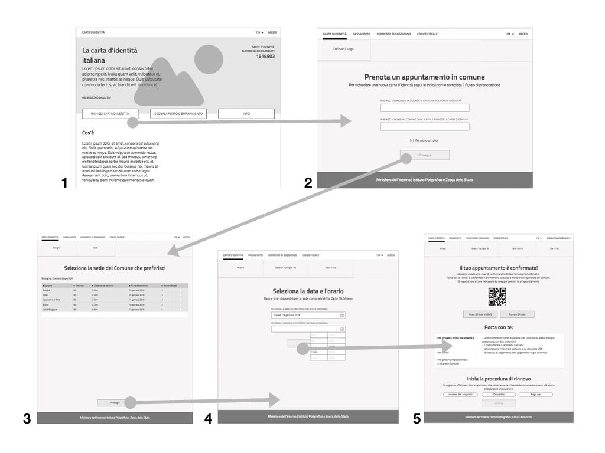
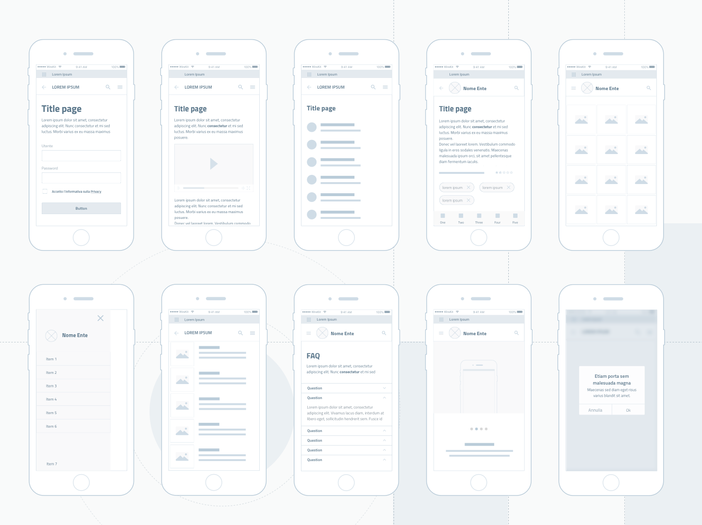
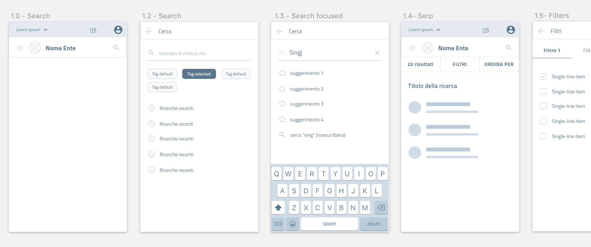

Prototipare un servizio
=======================

.. include:: /banner.rst

Un **prototipo** è un modello sperimentale che permette di testare
un’idea in maniera rapida ed economica, permettendo al team di rifinire
il progetto o di valutare cambiamenti di approccio, se si rivelano
necessari, prima di investire tempo e denaro nello sviluppo vero e
proprio. Uno dei principali vantaggi del processo di prototipazione
consiste nella possibilità di effettuare delle sessioni di validazione
dell’esperienza e del concept già nelle prime fasi della progettazione,
mantenendo gli utenti al centro del processo di design. Allo stesso
modo, un prototipo aiuta a coinvolgere gli stakeholder fin dalle prime
fasi del progetto, mostrando loro le soluzioni che il team sta
immaginando per rispondere ai bisogni degli utenti e agli obiettivi del
progetto. Infine, grazie a un prototipo è più facile valutare l’impatto
tecnologico di un progetto, e la presenza di limiti o opportunità
tecnologiche è un fattore rilevante nella evoluzione o modifica del
prototipo che si sta realizzando.

Nella prima fase il **prototipo** è **low-fi (low fidelity)**, a bassa
fedeltà. Questo tipo di manufatto ha diversi vantaggi:

-  **aiuta il designer a elaborare il modello d’interazione** a supporto
   dell’esperienza desiderata, verificando le proprie scelte
   direttamente “in pagina”;

-  **favorisce l’iterazione**, permettendo al designer di rielaborare in
   tempi ridotti i feedback ricevuti da altri membri del team o dagli
   stakeholder in tempi ridotti;

-  **elimina potenziali distrazioni** derivanti da elementi grafici e
   contenuti dettagliati, dando quindi la possibilità di concentrarsi
   solamente sulle funzionalità e i flussi.

La prototipazione **hi-fi (high fidelity)** interviene in un secondo
momento, quando l’organizzazione semantica e i flussi d’interazione sono
stati validati grazie al prototipo low-fi ed è possibile progredire
nella progettazione delle schermate inserendo gli elementi
d’interfaccia. Il prototipo hi-fi prevede la definizione precisa di
tutti gli elementi di `user
interface <http://design-italia.readthedocs.io/it/latest/doc/user-interface.html>`__
e `content
design <http://design-italia.readthedocs.io/it/latest/doc/content-design.html>`__,
lavorando in tre direzioni:

-  **alimenta il processo di condivisione** con gli stakeholder e gli
   altri membri della squadra di progetto;

-  consente di **indirizzare e documentare il lavoro di sviluppo
   front-end** del servizio digitale, facilitando la collaborazione di
   designer e developers;

-  **permette di verificare il concept** coinvolgendo gli utenti in
   sessione di validazione delle scelte progettuali.

Prototipi a bassa e media definizione 
-------------------------------------

I wireframe
~~~~~~~~~~~

Un wireframe è l’illustrazione a due dimensioni dell’interfaccia di una
pagina. Ha come priorità:

-  *l’organizzazione degli elementi interattivi e dei blocchi di
   contenuto nello spazio disponibile sullo schermo;*

-  *evidenziare le funzionalità disponibili*

-  *mostrare la sequenza di passaggi (userflow) che l’utente deve fare
   per concludere un processo;*

Date queste priorità, i wireframe non comprendono stili, colore o
grafica: possiamo chiamare questo tipo di wireframe anche wireframe
lo-fi o mid-fi, o a bassa o media definizione. Tra i suoi scopi, il
wireframe ha quello di mostrare le relazioni tra i contenuti del sito e
i flussi di interazione, e condurre progressivamente l’utente al
raggiungimento dei propri obiettivi. Questa funzione è assolta dai
wireframe interattivi (o user flow), sequenze di wireframe che
permettono di simulare il percorso dell’utente attraverso link e menù di
navigazione.

il wireframing fa largo utilizzo di **pattern**, ovvero di modelli di
rappresentazione dei contenuti e forme di interazione standard nel mondo
web. I\ `l wireframe kit di Designers
Italia <https://designers.italia.it/kit/wireframe-kit/>`__ presenta una
serie di pattern che definiscono alcuni modelli di contenuto e forme di
interazione tipiche dei siti e servizi della Pubblica Amministrazione
Italiana e che facilitano il processo di prototipazione di un servizio
offrendo una solida base da cui partire. Esempi di pattern sono il
**content type** “scheda servizio”, che definisce il modello di
presentazione di un servizio pubblico, oppure le modalità di
interrogazione di un motore di ricerca.

I modelli di pagina e di interazione sono costruiti attraverso una
libreria di **componenti** come bottoni, campi di input, blocchi di
testo, ecc. I componenti sono “i mattoncini” attraverso cui si
costruiscono le interfacce, gli elementi base della grammatica che
regola l’interazione tra l’utente e il sistema. Nel wireframe kit il
focus è sulle tipologie di componenti e non sulle loro caratteristiche
specifiche, che sono oggetto di definizione nella successiva fase di
prototipazione ad alta fedeltà.

.. figure:: media/image2.png
    :alt: Un esempio di “wireframe”, o prototipo a “bassa fedeltà”
    :name: Un esempio di “wireframe”, o prototipo a “bassa fedeltà”

*Figura 1 - Un esempio di “wireframe”, o prototipo a “bassa fedeltà”.*

*Nella Figura 1 è mostrato un esempio di prototipo costruito con un
programma di design, ma per costruire un wireframe si possono usare
diversi metodi, dalla carta ai numerosi software specifici presenti sul
mercato.*

*Figura 2*

*Wireframe interattivo (user flow) per il rinnovo della carta di
identità:*

1. Entro sul sito dedicato al rinnovo della carta d’identità

2. Seleziono la richiesta di rinnovo

3. Seleziono il Comune di appartenenza

4. Scelgo una data e ora tra quelle disponibili nel calendario

5. Ricevo conferma della prenotazione dell’appuntamento

Il wireframe kit
~~~~~~~~~~~~~~~~

Il prototipo a bassa fedeltà può essere modellato utilizzando il
**Wireframe Kit** messo a disposizione da Designers Italia che può agire
in diversi ambiti nella fase di design.

Per creare l’architettura di un sito o di un’app utilizzando il
Wireframe Kit, sarà quindi sufficiente scegliere e assemblare i
componenti e i pattern di cui il kit è composto.

Il Wireframe Kit è pubblicato su Github, una piattaforma che permette di
visionare tutte le fasi di progettazione e sviluppo grazie al controllo
di versione. Il wireframe kit è realizzato con il software Sketch, ma
può essere esportato per utilizzarlo con altri software di
prototipazione, se necessario.

-  Vai al `Wireframe kit <https://designers.italia.it/kit/wireframe-kit/>`__ di Designer Italia

-  Vedi i `file sorgente del Wireframe Kit <https://https//github.com/italia/design-wireframe-kit>`__

-  Vedi la presentazione dei `Wireframe Kit su InVision <https://invis.io/MJKVG83A8EZ>`__

.. figure:: media/image6.png
    :alt: Un esempio dei componenti presenti nel Wireframe Kit.
    :name: Un esempio dei componenti presenti nel Wireframe Kit.

    *Figura 2 - Un esempio dei componenti presenti nel Wireframe Kit.*

    *Figura 3 - Tipi di content type presenti nel wireframe kit*
    

    *Figura 4 - Pattern di ricerca: user flow*

.. figure:: media/ui-wireframe-kit-esempio-animato.gif
    :alt: UI Wireframe kit Esempio animato
    :name: UI Wireframe kit Esempio animato

    *Figura 5 - Un esempio di composizione dei componenti del Wireframe Kit per creare o adattare un content type alle esigenze del         prototipo. Il software scelto per costruire il Wireframe Kit è*\ `Sketch <https://www.sketchapp.com/>`__\ *, uno strumento che
    permette la gestione dinamica dei simboli e la condivisione della libreria in modo trasversale a tutti i file su cui si intende         lavorare. Sketch permette di cambiare le caratteristiche dei singoli elementi e personalizzarli in modo rapido e intuitivo.*
    *Alternativamente, è possibile importare il file Sketch in altri programmi di prototipazione, come*\ `Adobe XD                           <https://www.adobe.com/it/products/xd.html>`__\ *,*\ `Studio <https://studio.design/>`__\ *,
    o*\ `Figma <https://www.figma.com/>`__\ *.*
    

Dai wireframe ai prototipi in alta fedeltà (hi-fi)
~~~~~~~~~~~~~~~~~~~~~~~~~~~~~~~~~~~~~~~~~~~~~~~~~~

Una volta costruito, testato e migliorato il wireframe a bassa fedeltà,
possiamo passare alla realizzazione di un prototipo ad alta fedeltà (o
hi-fi) per agevolare la comprensione e la condivisione del progetto,
poter realizzare test e facilitare l’avvio della fase di sviluppo

A questo scopo potremo utilizzare

-  le linee guida relative alla `user
   interface <../../doc/user-interface.html>`__
   e all’\ `architettura
   dell’informazione <../../doc/content-design/architettura-dell-informazione.html>`__,
   `il kit per l’architettura
   dell’informazione <https://designers.italia.it/kit/information-architecture/>`__
   e lo `Ui Kit <https://designers.italia.it/kit/ui-kit/>`__ di
   Designers Italia, un set di componenti visive già pronte per
   assemblare l’interfaccia di un sito o di un’app,

-  `le linee guida relative ai
   contenuti <../../doc/content-design/linguaggio.html>`__
   e il `content kit <https://designers.italia.it/kit/content-kit/>`__,
   una serie di standard per il linguaggio da utilizzare nei siti e
   nelle app della Pubblica Amministrazione seguendo le linee guida per
   i servizi digitali della Pubblica Amministrazione.

