================================================================================
Il disegno di un’interfaccia e lo UI Kit
================================================================================

.. include:: /banner.rst

Il disegno dell’interfaccia
================================================================================

Il disegno dell’interfaccia in “alta fedeltà” (in inglese *hi-fi*) è la fase finale della progettazione che si concentra sugli aspetti grafici di *visual design*, aggiungendo dettagli, stile e animazioni.

L’interfaccia viene costruita tenendo come punto di riferimento il *wireframe* contenente la struttura generale del prodotto: lo scheletro viene trasformato e arricchito in modo da dare una resa reale del prodotto finale, nonostante questa sia ancora mancante di tutta quella parte di interazione con l’utente che verrà realizzata durante la fase di sviluppo.

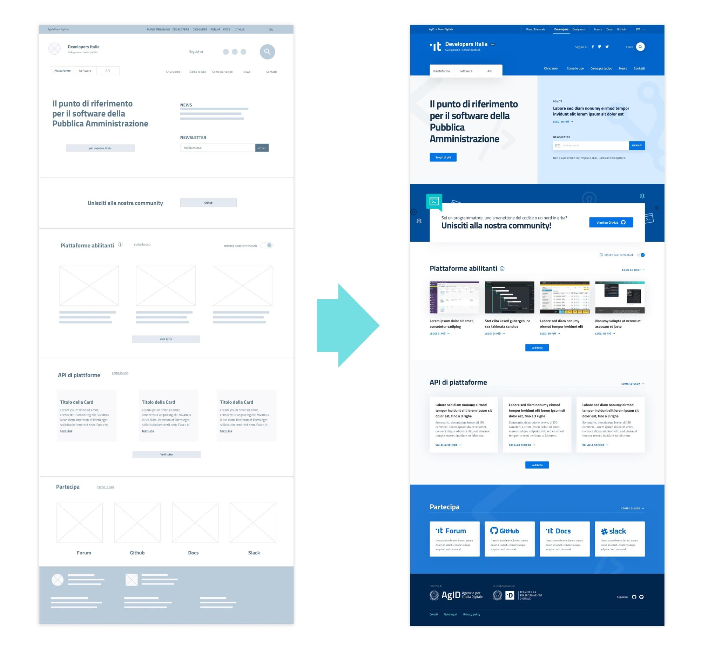

    Un esempio di un progetto di pagina web desktop a bassa fedeltà, a sinistra, e, a destra, la realizzazione dell’interfaccia grafica ad alta fedeltà.

Il *visual design* dell’interfaccia utente, specularmente al *wireframe*, sarà quindi composto da diversi elementi come bottoni, campi di compilazione, menù, blocchi di testo ecc., i quali di norma vengono combinati e posizionati seguendo una griglia per organizzare il loro posizionamento nello spazio.

Uniformità ed identità
--------------------------------------------------------------------------------

Il *visual design* serve quindi a presentare informazioni e comportamenti in modo comprensibile e semplice tenendo presente non soltanto l’aspetto estetico, ma soprattutto le esigenze dell’utente.

Tutto ciò che riguarda lo stile è soltanto una parte del prodotto.

Sebbene la comunicazione visiva attiri giudizi soggettivi, le tematiche legate al gusto estetico non sono così fondamentali come si possa pensare. Tutto ciò che afferisce all’aspetto estetico fornisce degli indizi o crea delle emozioni, ma non è sufficiente ad ottenere un’esperienza soddisfacente.

Una chiara rappresentazione degli obiettivi dell’esperienza utente (*user experience*) del prodotto sono invece le fondamenta imprescindibili di tutti quegli aspetti di interfaccia utente che fanno parte dell’identità e che generano una risposta emozionale positiva.

L’interfaccia utente (*User Interface*, in breve *UI*) è di fatto una **conversazione tra l’utente e il prodotto**, attraverso dei task che servono a far raggiungere gli obiettivi di progetto per il cittadino. La logica di funzionamento è la stessa di una conversazione tra due persone: la comunicazione è focalizzata sull’obiettivo e deve essere efficace per ottenere una comprensione chiara e completa.

Standard visuali
^^^^^^^^^^^^^^^^^^^^^^^^^^^^^^^^^^^^^^^^^^^^^^^^^^^^^^^^^^^^^^^^^^^^^^^^^^^^^^^^

L’uniformità di un’interfaccia, concretizzata attraverso degli **standard visuali e di comportamento**, fa sì che, se applicata correttamente, porti importanti benefici.

In primo luogo, gli utenti utilizzeranno più rapidamente e con facilità i percorsi che hanno già imparato a riconoscere. Potranno prevedere i comportamenti del prodotto basandosi su un’esperienza pregressa.

In secondo luogo, portano ad una riduzione dei costi di produzione attraverso il riuso di design e di codice già pronti e che sono il risultato di discussioni e decisioni già prese, favorendo anche una **riduzione dei costi di supporto e assistenza agli utenti** poiché gli *standard* incrementano la facilità d’uso e di apprendimento.

L’applicazione di un modello non basta però a costruire una buona interfaccia: gli *standard* rispondono a questioni relative a generali processi cognitivi e di percezione. Essi **devono essere inglobati nel contesto di riferimento**, che presuppone un’organizzazione logica e strutturale, che può richiedere specifici “comportamenti” e scegliere percorsi dedicati a particolari bisogni dell’utente.

È possibile approfondire queste tematiche anche nel paragrafo :ref:`Conoscere gli utenti <conoscere-gli-utenti>`.

Lo stile
--------------------------------------------------------------------------------

Lo stile è il "linguaggio" del design, ed è costituito da elementi variabili come la forma, il colore, la tipografia, o l’applicazione di spazi coerenti tra loro.
Questi aspetti sono combinati insieme per creare una risposta emozionale (riconoscibilità, confidenza con il servizio), e dare solidità e consistenza al layout, aiutando l’utente nella navigazione e nella ricerca delle informazioni.

Lo stile è trasversale a tutti i componenti di una interfaccia: ognuno è costruito sulla base di una griglia, utilizzando ben definite palette di colori, tipo  e dimensione dei caratteri, spaziature, ombre, ecc.

Lo UI Kit per la creazione dell’interfaccia
================================================================================

Il prototipo ad alta fedeltà può essere costruito utilizzando lo **UI kit** messo a disposizione da Designers Italia e descritto di seguito, di cui si possono trovare i file sorgente in formato *Sketch* sul repository GitHub dedicato:

- `Vedi i file sorgente dello UI Kit <https://github.com/italia/design-ui-kit>`_

Esso è inoltre pubblicato su InVision, una piattaforma di condivisione dove è possibile vedere tutti gli elementi disponibili:

- `Vedi lo UI Kit su InVision <https://invis.io/RJFGS2UC3HS>`_

Lo UI Kit fornisce una libreria di elementi già pronti che possono essere assemblati per montare un’interfaccia utente adatta a servizi della PA.

Gli elementi di cui si compone il kit sono raggruppati nelle seguenti categorie principali:

* Tipografia
* Definizione di colori e loro applicazione
* Posizionamento e spaziature, con un sistema di griglie
* Icone
* Bottoni
* Elementi di navigazione, come menu e liste di link
* Elementi per la visualizzazione di dati e contenuti
* Elementi di data entry, come campi di testo ed esempi di form

La costruzione degli elementi segue una `roadmap <https://docs.google.com/spreadsheets/d/183hI6EBJo3EeiEcQPGZIe3hNN7EerTU5Udk6SkrH2OU/edit?usp=sharing>`_ dove si può osservare e commentare il progetto in corso di realizzazione.

Poiché l’approccio è *open source*, le Pubbliche Amministrazioni, le agenzie e singoli cittadini possono contribuire alla discussione e alla modifica dello UI Kit stesso.

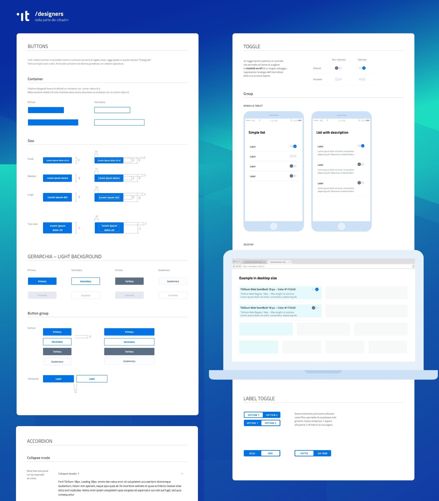

    Un esempio di componenti dello UI Kit con le indicazioni necessarie alla loro applicazione.

Come si usa lo UI Kit
--------------------------------------------------------------------------------

Lo UI Kit è realizzato seguendo un **sistema a blocchi**, che può essere paragonato ad un set di pezzi componibili, dimensionati in modo da poter essere assemblati ed adattati.

.. figure:: images/ui-kit-blocks.gif
    :alt: Costruzione di un’interfaccia attraverso i principi di composizione.
    :name: Costruzione di un’interfaccia attraverso i principi di composizione.

    Costruzione di un’interfaccia attraverso i principi di composizione.

Ogni componente ha un numero di proprietà ad esempio la forma e il colore che possono essere combinati o variati per comunicare un diverso significato. Si pensi ad esempio ad un bottone: esso può essere, “primario” o “secondario”, in stato di “riposo” o “premuto”. Il modo in cui sono applicate queste proprietà o variazioni darà un significato differente al componente.

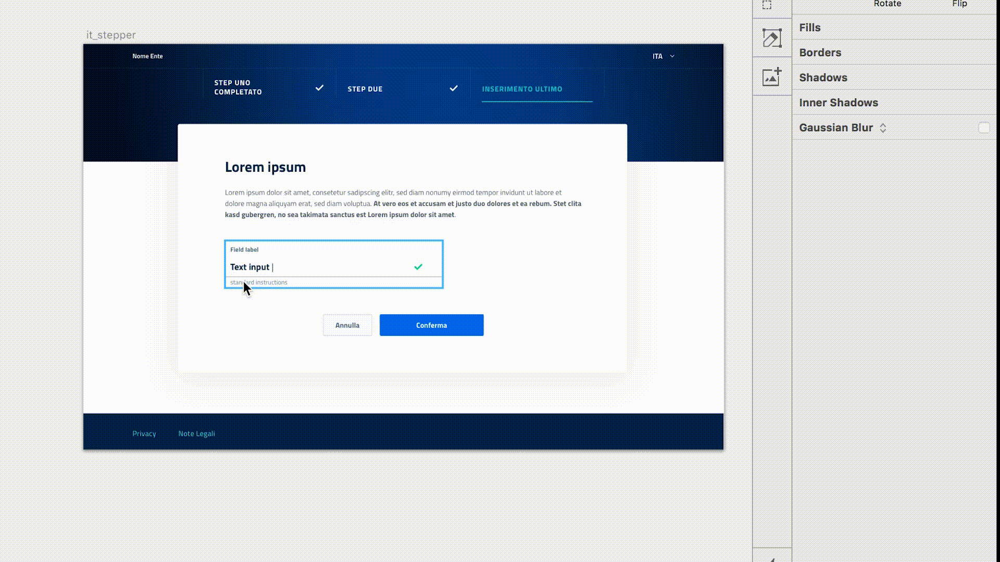

    Variazioni di un’interfaccia.

Il software scelto per costruire lo UI Kit è `Sketch <https://www.sketchapp.com/>`_.

La scelta di questo software è legata ad alcune caratteristiche fondamentali. In primo luogo, è possibile gestire la libreria di componenti in modo trasversale a tutti i file che si vogliono creare ed aggiornarla qualora vengano modificati i componenti. Inoltre, mettendo a disposizione una piattaforma di sviluppo collaborativo, permette di installare innumerevoli estensioni (*plugin*) a seconda delle esigenze di design.

In alternativa, è possibile importare il file Sketch in altri programmi di prototipazione, come `Adobe XD <https://www.adobe.com/it/products/xd.html>`_, `Studio <https://studio.design/>`_, o `Figma <https://www.figma.com/>`_.

La tipografia
--------------------------------------------------------------------------------

La principale famiglia di font usata nello UI Kit è il **Titillium Web**.
È stato scelto come *typeface* principale per i contenuti web, grazie alla x-height ampia, alla struttura lineare e alla flessibilità d’uso essendo composto da 11 stili.

Il `Titillium Web <https://fonts.google.com/specimen/Titillium+Web>`_ è stato realizzato come progetto didattico dagli studenti del corso in Type Design dell’Accademia di Belle Arti di Urbino.

    Il font Titillium Web.

Un typeface secondario è il **Roboto Mono**, la variante *monospaced* della famiglia Roboto. È stato introdotto nelle Linee Guida per la chiarezza e leggibilità dei numeri pertanto è adatto ad essere utilizzato per la rappresentazione di numeri, calcoli matematici, numeri in tabelle, codice di programmazione.

    Il font Roboto Mono.

Un terzo typeface con grazie (o *serif*) è il **Lora**, introdotto per la sua leggibilità e nato espressamente per la lettura su display.

    Il font Lora.

Tutti questi *typeface* sono rilasciati con licenza SIL Open Font License e sono scaricabili da `Google Fonts <https://fonts.google.com/>`_, una piattaforma di distribuzione gratuita di *font* per il web.

Corpo del testo
^^^^^^^^^^^^^^^^^^^^^^^^^^^^^^^^^^^^^^^^^^^^^^^^^^^^^^^^^^^^^^^^^^^^^^^^^^^^^^^^

Le misure dei caratteri non devono essere utilizzate senza una logica, ma devono seguire una **scala tipografica** precisa e studiata appositamente per creare una **gerarchia visiva**.

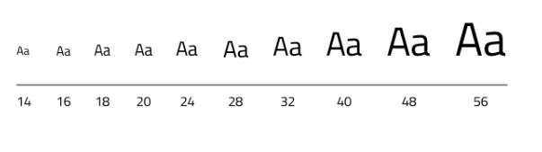

    Un esempio di scala tipografica.

La gerarchia serve a gestire la trasmissione di un messaggio e il suo impatto, e quando non viene utilizzata la comunicazione diventa meno efficace.

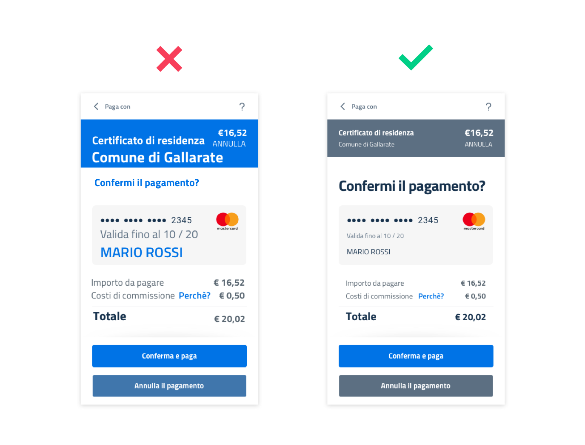

    Un esempio di gerarchia.

La dimensione del corpo del testo, con riferimento ad esempio al font *Titillium Web*, non può essere inferiore a 16px per uno schermo mobile e inferiore a 18px per schermi grandi.

Si possono utilizzare misure inferiori in caso di didascalie, note, o testi di secondaria importanza che per lunghezza o posizionamento nella pagina richiedano dimensioni ridotte.

Dimensionamento dei paragrafi
^^^^^^^^^^^^^^^^^^^^^^^^^^^^^^^^^^^^^^^^^^^^^^^^^^^^^^^^^^^^^^^^^^^^^^^^^^^^^^^^

La lunghezza di un paragrafo che permetta una lettura confortevole del testo non dovrebbe superare i **75 caratteri**. In caso di colonne multiple, la lunghezza può essere compresa tra 40 e 50 caratteri. Per testi a margine, la lunghezza è non dovrebbe essere inferiore ai 15 caratteri.

Un paragrafo di testo deve essere composto con **allineamento a sinistra**. Nei casi in cui si prevedono paragrafi a margine posti a sinistra del blocco di testo principale, il paragrafo può essere allineato a destra. L’allineamento giustificato e senza sillabazione è invece sempre da evitare per l’incongrua spaziatura delle parole e la minore leggibilità che comporta.

I paragrafi possono essere distinti applicando uno spazio verticale tra di essi o, in alternativa, usando una indentatura di misura pari a quella dell’interlinea.

L’interlinea (in inglese, *leading*), sia dei titoli che del corpo del testo, è calcolata tenendo conto di una immaginaria **griglia di 8px**, in modo da creare una sorta di “ritmo verticale” nella lettura.

Colore del testo
^^^^^^^^^^^^^^^^^^^^^^^^^^^^^^^^^^^^^^^^^^^^^^^^^^^^^^^^^^^^^^^^^^^^^^^^^^^^^^^^

Il colore del testo deve essere tale da garantire un rapporto di contrasto minimo con lo sfondo sfondo di 4,5:1 (AA) **come stabilito dalle specifiche di accessibilità**. Approfondisci nella sezione :doc:`/doc/service-design/accessibilita`.

Collegamenti
^^^^^^^^^^^^^^^^^^^^^^^^^^^^^^^^^^^^^^^^^^^^^^^^^^^^^^^^^^^^^^^^^^^^^^^^^^^^^^^^

I collegamenti (in inglese, *link*) ad altre aree del servizio o a siti esterni devono avere un elemento di distinguibilità rispetto al testo normale.

Pertanto, è buona norma mantenere una **sottolineatura**, specialmente se il link è inserito all’interno di un paragrafo. Alternativamente, si può utilizzare anche il grassetto.

Il colore
--------------------------------------------------------------------------------

Il colore è un elemento essenziale nella definizione di un’interfaccia: può servire a differenziare, connettere, evidenziare, nascondere. Contribuisce alla gerarchia visiva e può essere un elemento di supporto alla comunicazione.

.. NOTE::
    Il colore influisce sull’accessibilità del prodotto. Gli utenti affetti da disabilità visive come la deuteranopia, protanopia e tritanopia potrebbero non vedere bene i colori oppure non vederli affatto. Approfondisci nella sezione :doc:`/doc/service-design/accessibilita`.

Lo schema colore
^^^^^^^^^^^^^^^^^^^^^^^^^^^^^^^^^^^^^^^^^^^^^^^^^^^^^^^^^^^^^^^^^^^^^^^^^^^^^^^^

La scelta dei colori è dettata dal materiale identitario dell’Ente o Agenzia (logo, stemma, gonfalone etc.) o comunque da elementi afferenti alla sua riconoscibilità.

In uno schema colore distinguiamo il colore base, che viene utilizzato per una percentuale maggiore rispetto agli altri colori, i **colori secondari** e i **colori neutri** (ad esempio grigi, bianco, nero).

Tra i colori secondari si dovranno definire:

* colori strettamente connessi al colore base
* un eventuale colore di risalto (chiamato *accent color*), utilizzato in misura minore poiché è associato a elementi che prevedono un’interazione, come bottoni, elementi di controllo (sliders, radio, ecc.), link, campi di testo.

Si consiglia l’utilizzo di una palette costituita da non più di 5 tonalità, dove non più di 3 avranno un differente valore di colore (*hue*, in inglese).

La palette può essere:

* monocromatica, quando è costituita dal colore base e dalle sue variazioni in termini di saturazione e/o luminosità.
* policroma, ossia costituita da associazioni di colori con differente *hue*. Questo tipo di schema oltre al colore base e alle sue variazioni, comprende un colore che può essere scelto tra gli analoghi, complementari, triadici, ecc. del colore base, oppure scelto dalla gamma di colori appartenenti all’identità visiva.

La palette estesa
^^^^^^^^^^^^^^^^^^^^^^^^^^^^^^^^^^^^^^^^^^^^^^^^^^^^^^^^^^^^^^^^^^^^^^^^^^^^^^^^

La palette può essere **estesa**, creando variazioni in termini di saturazione e luminosità dei colori scelti come “colore base”, da cui si possono generare tinte, ombre e toni.

Le **tinte** e le **ombre** consistono nell’aggiunta rispettivamente di bianco e di nero al colore di base, che significa variare i valori di **saturazione** (in inglese *saturation*, indicata con *“S”*) e **luminosità** (in inglese *brightness*, indicata con *“B”*).

Per esempio, dato un colore base con i valori `H 93; S 100; B 50`, si possono sottrarre 10 gradi di luminosità (B) per ottenere le variazioni più scure o aggiungere 10 gradi di luminosità (B) per quelle più chiare fino a un massimo di 80 gradi di luminosità.

Per ottenere le cosiddette “tinte” basta aumentare progressivamente di 4 gradi la luminosità (B) a partire da un valore di 80 e contemporaneamente diminuire la saturazione (S) di 15 gradi.

.. figure:: images/ui-colori-palette-estesa.png
    :alt: Un esempio di variazioni di colore.
    :name: Un esempio di variazioni di colore.

    Un esempio di variazioni partendo dal colore base H 93, S 100, B 50 verso le tinte (in alto) e verso le ombre (in basso)

Per ottenere diversi **toni** è necessario diminuire contemporaneamente i valori di saturazione e luminosità di 10 gradi.

La palette delle Amministrazioni Centrali
^^^^^^^^^^^^^^^^^^^^^^^^^^^^^^^^^^^^^^^^^^^^^^^^^^^^^^^^^^^^^^^^^^^^^^^^^^^^^^^^

Un esempio di schema cromatico costruito sui principi appena descritti è la palette realizzata con il colore base **“Blu Italia”** (codice esadecimale *#0066CC*).

Pensata per un design semplice e minimalista, è una palette costituita dalle variazioni del colore base, più le tinte neutre. Sono presenti anche colori che possiamo definire *“utility colors”*, ossia colori da utilizzare per i messaggi di feedback all’utente (errori o notifiche) o per la realizzazione di elementi grafici.

La palette dello UI Kit è piuttosto estesa: comprende molte variazioni in tinte, toni e ombre del colore base (il “Blu Italia”), e dei colori secondari e neutri, permettendo così una certa flessibilità di uso.

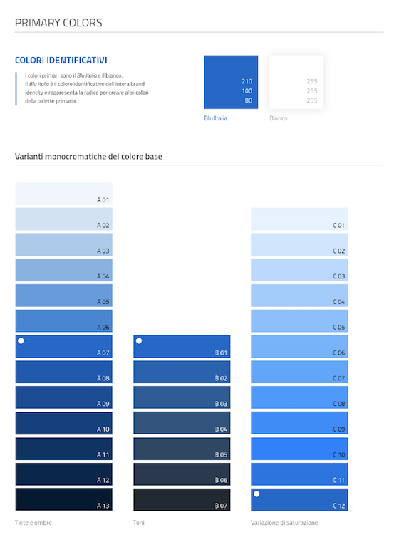

    Un esempio di palette monocromatica estesa.

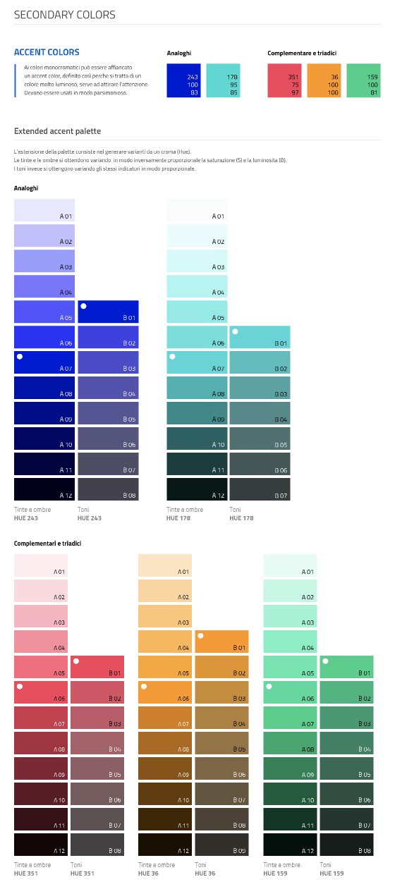

    Un esempio di palette monocromatica estesa di colori per elementi in evidenza.

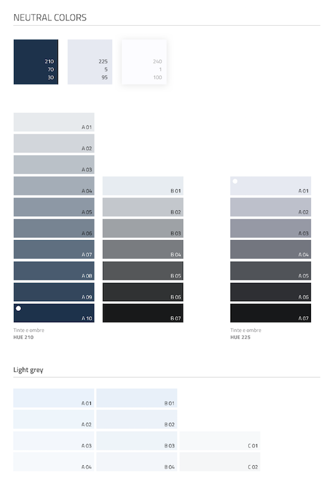

    Un esempio di palette monocromatica estesa di colori neutri.

Le Griglie
--------------------------------------------------------------------------------

All’interno dello spazio a disposizione, l’organizzazione del contenuto deve essere strutturata seguendo un sistema di **griglie responsivo**, per mantenere una efficace esperienza utente trasversalmente ai dispositivi utilizzati.

La griglia rappresenta la struttura invisibile che permette di organizzare i contenuti della pagina. Una griglia di impaginazione consiste in **colonne di testo e immagini**, separate da spazi *intercolonna* e contornate da margini esterni.

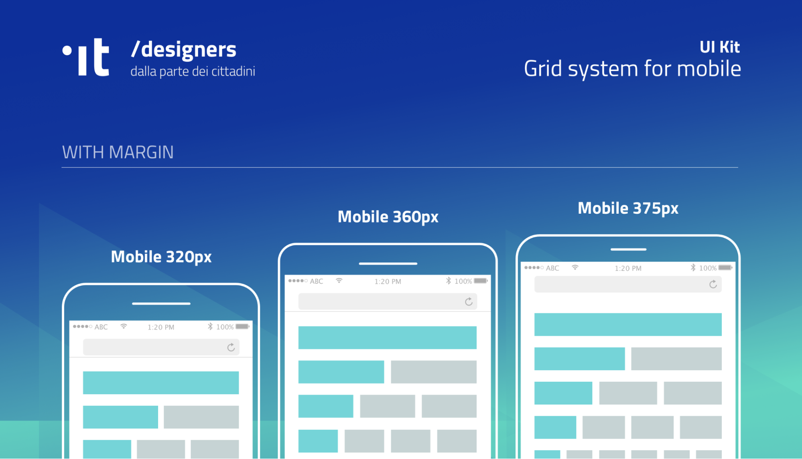

    Un esempio di griglia applicata a diverse risoluzioni dello schermo.

Le dimensioni delle colonne vanno adattate ai cambiamenti della viewport: ogni colonna occuperà una percentuale di spazio specifica a seconda che sia visualizzata su dispositivi desktop, tablet, o smartphone.

La disposizione dei contenuti, a seconda delle dimensione dello schermo, garantisce che i testi siano leggibili anche sugli schermi più piccoli e l’interazione utente (ad esempio, l’utilizzo di form e controlli dinamici) rimanga agevole.

+---------------------------------+--------------+-------------------+-------------------+--------------+
| Risoluzione                     | Small        | Medium            | Large             | Extralarge   |
+---------------------------------+--------------+-------------------+-------------------+--------------+
| Breakpoint                      | fino a 768px | da 768px a 991px  | da 992px a 1279px | oltre 1280px |
+---------------------------------+--------------+-------------------+-------------------+--------------+
| Larghezza massima del container | nessuna      | 688px             | 904px             | 1184px       |
+---------------------------------+--------------+-------------------+-------------------+--------------+
| Spaziatura                      | 12px         | 20px              | 20px              | 28px         |
+---------------------------------+--------------+-------------------+-------------------+--------------+

La griglia orizzontale contribuisce alla consistenza del design e a determinare il pattern di lettura di un sito web. In un sistema condiviso come quello di uno UI Kit, è necessario avere una metrica comune, per mantenere coerenza anche tra diversi siti web appartenenti a enti o pubbliche amministrazioni diverse.

La griglia orizzontale è definita sulla baseline del testo, ossia la linea dove poggiano le lettere del font scelto. La baseline diventa una griglia a cui ancorare non solo il testo ma anche gli oggetti del layout. La baseline è di 8px ed è basata sul Titillium a 16px.

Avendo come base la misura di 8 px e i suoi multipli per calcolare dimensioni, padding e margini dei vari elementi, si può ottenere un ritmo verticale armonico.

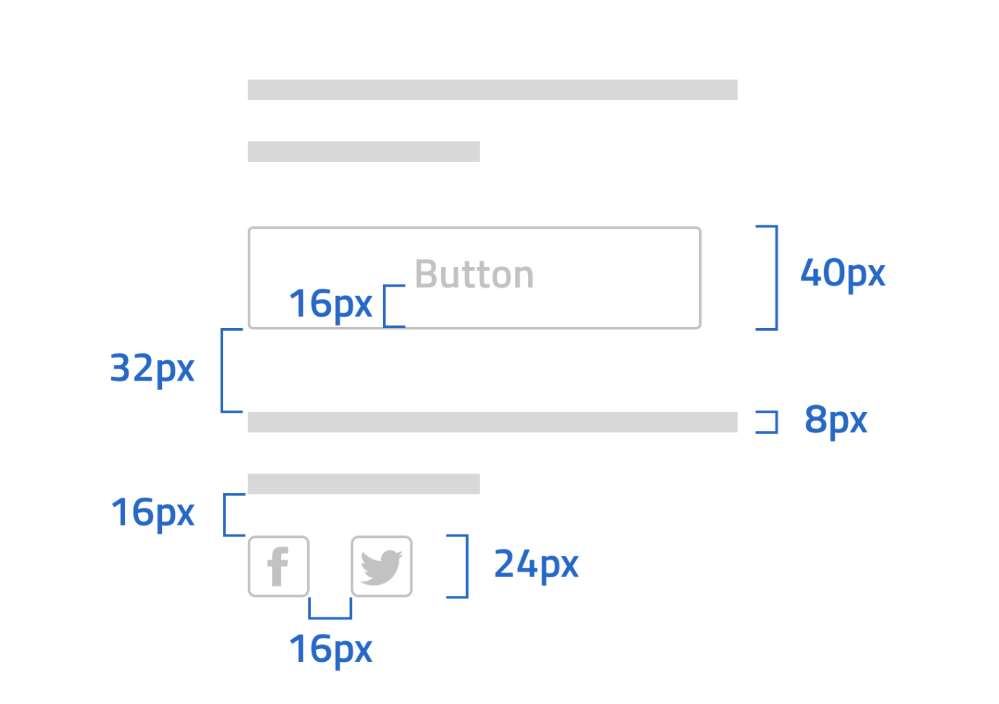

    Un esempio di componente con baseline a 8px.

.. NOTE::
    È possibile approfondire l’argomento su un post di Designers Italia intitolato: “`Le griglie: alla scoperta dello Ui Kit di designers <https://medium.com/designers-italia/le-griglie-alla-scoperta-dello-ui-kit-di-designers-italia-partendo-dalle-basi-d7943cbdccc9>`_”.

Le icone
--------------------------------------------------------------------------------

Quando si utilizzano delle icone è necessario assicurare una chiara comprensione del loro significato. Pertanto ogni icona dovrà essere associata ad un tooltip o ad un piccolo testo che ne chiarisca l’azione. La stessa icona non dovrà essere utilizzata per indicare azioni diverse all’interno della stesso contesto.

Al fine di garantire una coerenza visiva si consiglia di utilizzare icone provenienti da un unico set grafico come, ad esempio, quelle disponibili gratuitamente su `Font Awesome <https://fontawesome.com/>`_ o il set di icone in formato SVG incluso in `Bootstrap Italia <https://italia.github.io/bootstrap-italia/docs/utilities/icone/>`_.

I componenti
--------------------------------------------------------------------------------

Di seguito sono presentati per ogni categoria degli esempi di componenti dello UI Kit. Per avere un quadro completo del kit è possibile collegarsi al progetto `UI Kit su InVision <https://invis.io/RJFGS2UC3HS>`_.

Bottoni
^^^^^^^^^^^^^^^^^^^^^^^^^^^^^^^^^^^^^^^^^^^^^^^^^^^^^^^^^^^^^^^^^^^^^^^^^^^^^^^^

Lo UI Kit contiene quattro tipologie di bottoni, dal primary al quaternary, ordinati secondo una funzione gerarchica.

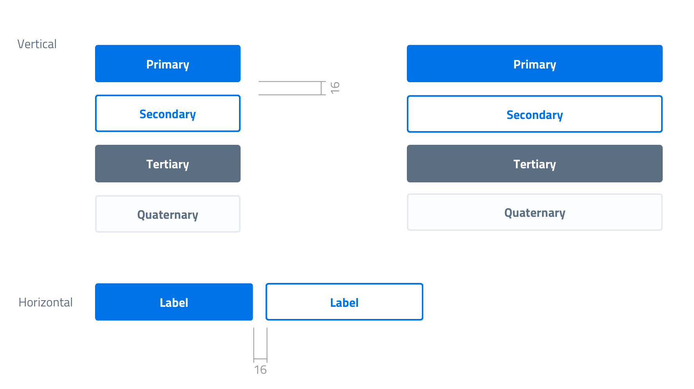

    Un esempio di componente “Bottone” nelle sue varianti, ordinate gerarchicamente.

Tutte le azioni principali sono rappresentate dal bottone “Primary”, a cui può essere associata una o più azioni secondarie attraverso l’uso degli altri bottoni a disposizione.

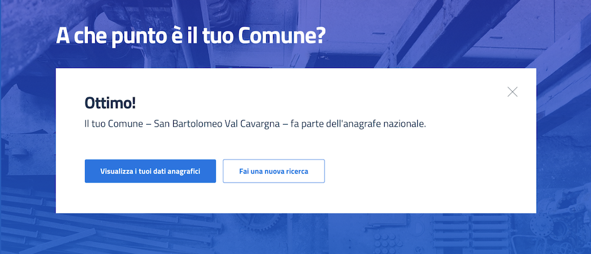

    Un esempio d’uso del bottone “Primary” e “Secondary”. Il primario mostra l’azione più importante della pagina, il secondario rappresenta un’azione alternativa.

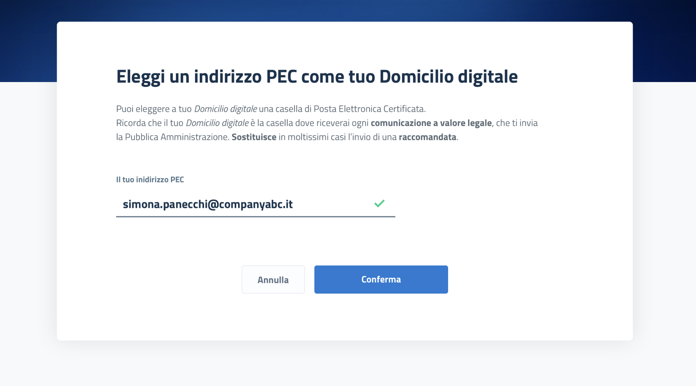

    Un esempio d’uso di un bottone “Primary” associato ad un bottone gerarchicamente inferiore. In questo caso è stato usato un “Quaternary” dello UI Kit: l’utente cosi è indirizzato sul bottone primario in modo inequivocabile.

Navigazione
^^^^^^^^^^^^^^^^^^^^^^^^^^^^^^^^^^^^^^^^^^^^^^^^^^^^^^^^^^^^^^^^^^^^^^^^^^^^^^^^

I componenti che possiamo inserire all’interno della navigazione sono molteplici. Ad esempio, si riportano il componente “Tabs” e il “Menu” per dispositivi mobili.

Nel kit sono costruite diverse varianti di “Tab”, sia le varianti per diverse dimensioni di schermo, sia per fondo chiaro e fondo scuro, con solo testo o solo icone, oppure con la presenta di entrambi.

È possibile vedere in figura il componente Tab con un esempio di applicazione nell’ambito di filtri di ricerca.

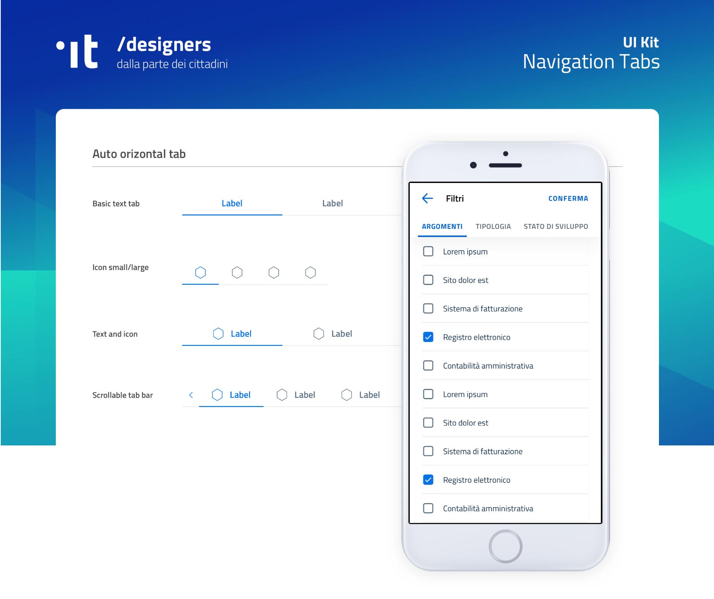

    Un esempio di componente “Tab” applicato a filtri di ricerca.

Il componente “Menu” mobile mostrato nella figura seguente ha alcune utili varianti: oltre alla differenza di sfondo, c’è anche una distinzione del menu in sezioni con o senza intestazione.

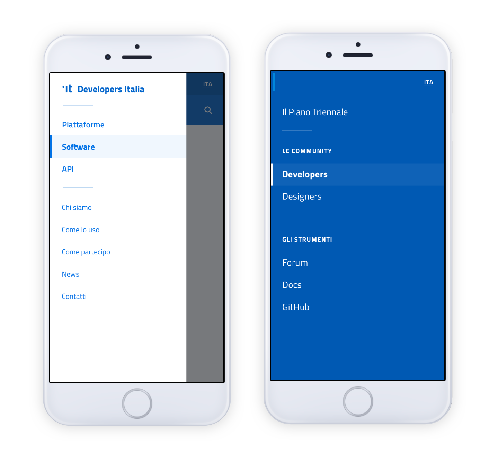

    Un esempio di menu per dispositivi mobili.

Data display
^^^^^^^^^^^^^^^^^^^^^^^^^^^^^^^^^^^^^^^^^^^^^^^^^^^^^^^^^^^^^^^^^^^^^^^^^^^^^^^^

Nella categoria Data Display sono inseriti i componenti che hanno come funzionalità quella di mostrare informazioni in modo organizzato oppure evidenziato, come ad esempio gli “Accordion” o i “Callout”.

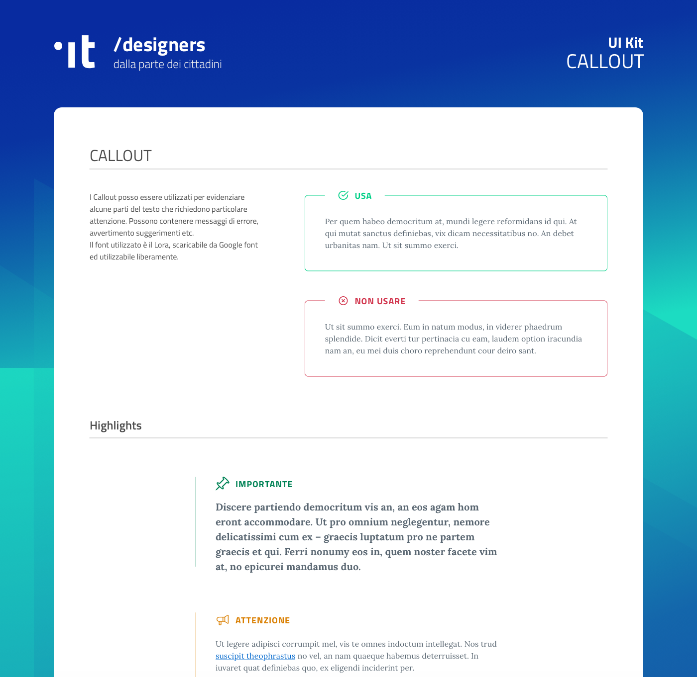

    Un esempio di componente “Callout”.

Data entry
^^^^^^^^^^^^^^^^^^^^^^^^^^^^^^^^^^^^^^^^^^^^^^^^^^^^^^^^^^^^^^^^^^^^^^^^^^^^^^^^

Esempi di componenti appartenenti alla categoria Data entry sono i campi di tipo “Input” che si utilizzano per costruire form. Il componente è costruito in modo da poter attivare o disattivare i diversi status: normale, avvertimento, errore, successo.

L’etichetta del campo è indicativa di cosa va inserito. All’attivazione del campo con il cursore, l’etichetta si sposta in alto.

Nel componente si possono attivare oltre gli stati di feedback, gestendo colori e icone, anche i relativi messaggi.

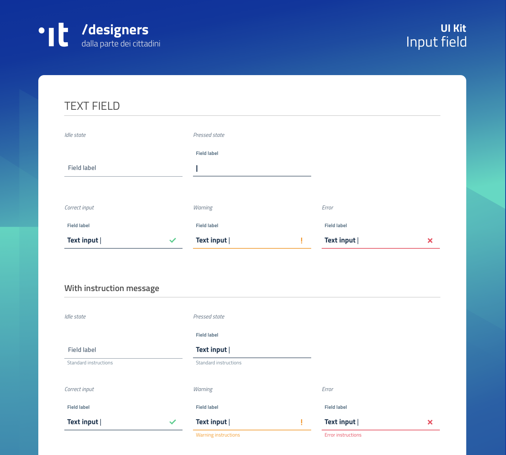

    Un esempio di form contenente componenti “Input”.

Gli strumenti
================================================================================

Lo UI Kit è disponibile a tutti in formato *Sketch* sul repository GitHub dedicato, un servizio di hosting dove è possibile commentare, caricare files e interagire tramite messaggi (*issue*) e contributi (*pull request*).

- Vedi i `file sorgente dello UI Kit <https://https://github.com/italia/design-ui-kit>`_ oppure scopri com `caricare il kit come libreria esterna <https://github.com/italia/design-ui-kit/wiki/Sketch-Libraries>`_ all’interno del tuo progetto

Esso è inoltre pubblicato per consultazione su InVision:

- Vedi lo `UI Kit su InVision <https://invis.io/RJFGS2UC3HS>`_
