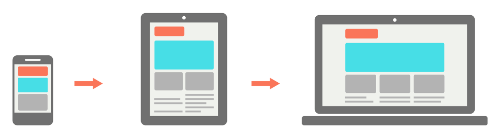
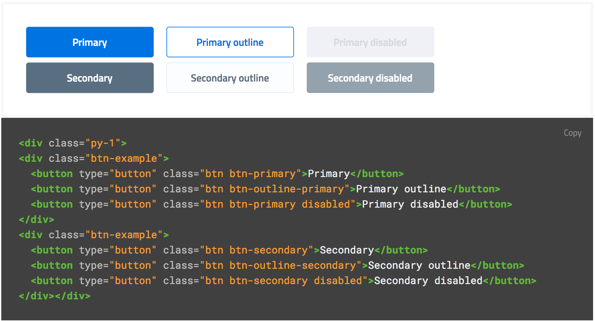
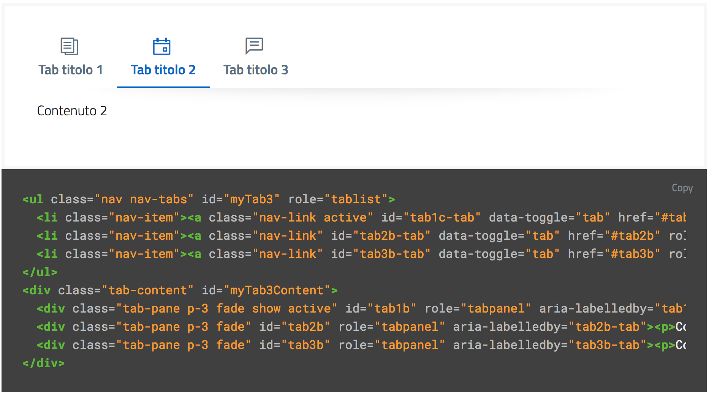
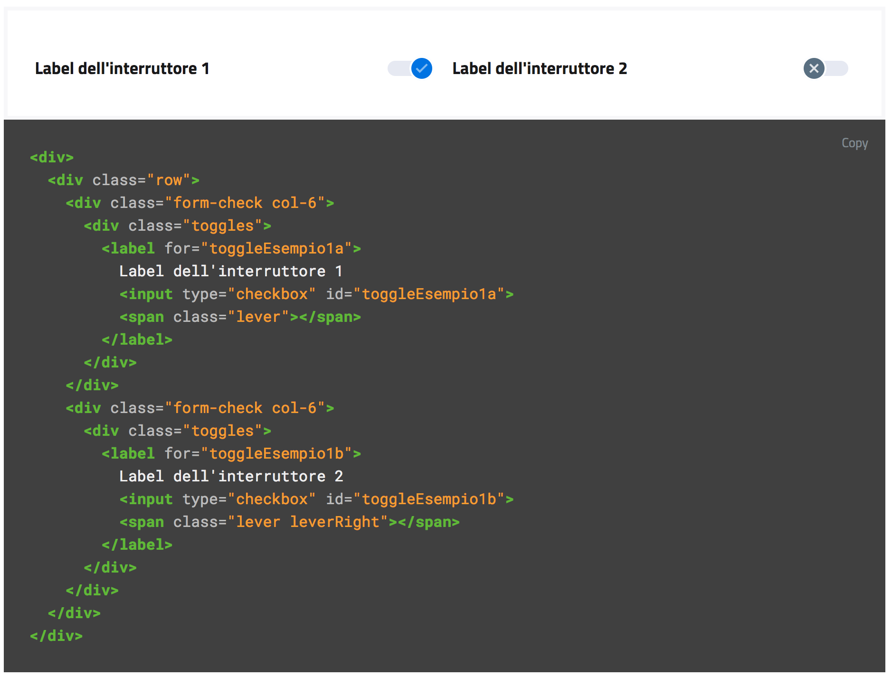

================================================================================
Lo sviluppo di un’interfaccia e i Web Kit
================================================================================

.. include:: /banner.rst

Alcune attività preliminari alla fase di sviluppo
================================================================================

Durante le fasi iniziali dello sviluppo di un sito web professionale, è di fondamentale importanza dedicare tempo e risorse ad alcune attività che avranno impatto sull’intero ciclo di vita del progetto:

* un’analisi di **componenti** (librerie, linguaggi, documentazione, ecc.) e **best practices** già utilizzate e validate dalla comunità, che possano **semplificare e standardizzare** la realizzazione del servizio.
* una revisione dei requisiti di progetto con lo scopo di ottenere un **documento di specifiche** condiviso, che possa anche definire **ruoli** e **responsabilità**.
* la selezione di una metodologia di **sviluppo agile** ottimale per il team di lavoro, con una conseguente definizione precisa delle procedure di comunicazione, di testing e di rilascio cadenzato.

Contestualmente a questa fase di *kick-off* tecnico, è auspicabile avviare sin da subito una fase di prototipazione avanzata, con la quale iniziare a validare in modo iterativo ogni progresso raggiunto. Questo obiettivo può essere ottenuto sia con classici test manuali, che attraverso un’adeguata *continuous integration* che faccia uso di test automatici.

In caso di applicazioni ad alta interattività o di grandi dimensioni, anche la metodologia di lavoro è fondamentale: un approccio `BDD <https://it.wikipedia.org/wiki/Behavior-driven_development>`_ per la stesura delle funzionalità, e l’uso della stessa metodologia per l’applicazione di test funzionali, unit test e test di integrazione, possono essere elementi chiave per il buon funzionamento e la solidità dell’applicazione.

Approccio
--------------------------------------------------------------------------------

Web design responsivo
^^^^^^^^^^^^^^^^^^^^^^^^^^^^^^^^^^^^^^^^^^^^^^^^^^^^^^^^^^^^^^^^^^^^^^^^^^^^^^^^

Il sito web deve **sempre** essere progettato e sviluppato con un approccio *responsive*, con l’obiettivo di fornire un’esperienza d’uso ottimale indipendentemente dalla risoluzione dello schermo e dal tipo di dispositivo utilizzato, consentendo in ogni situazione facilità di lettura e navigazione.

Al concetto di responsive web design vanno associate pratiche di semplificazione delle interfacce in ottica *mobile first*, e un’attenzione particolare nel fornire un’esperienza soddisfacente anche a coloro che hanno difficoltà visive o motorie.

.. NOTE::
   È possibile approfondire l’argomento nella `sezione dedicata all’accessibilità <../service-design/accessibilita.html>`__ nell’area Service Design.

Mobile first
^^^^^^^^^^^^^^^^^^^^^^^^^^^^^^^^^^^^^^^^^^^^^^^^^^^^^^^^^^^^^^^^^^^^^^^^^^^^^^^^

L’approccio *mobile first* è, assieme all’utilizzo di *progressive enhancement* trattato di seguito, una pratica oramai consolidata: consiste nel valutare in prima istanza l’esperienza e le necessità per gli utilizzatori di dispositivi mobili, per poi arricchire di elementi e funzionalità la composizione della pagina mano a mano che la dimensione, le capacità computazionali e di rete del dispositivo aumentano.

    Un esempio di approccio mobile first.

Nell’approccio mobile first **si parte dall’essenziale**.

La forzatura nella progettazione di un’applicazione con ridotte disponibilità di spazio, di interazione, di velocità di caricamento costringe a stabilire delle priorità e a fare delle scelte che risulteranno utili all’usabilità del prodotto.

Per *progressive enhancement* si intende una pratica fondante per lo sviluppo di una nuova applicazione web flessibile e a prova di future evoluzioni di dispositivi e browser, con la quale la lavorazione inizia da un nucleo solido e irrinunciabile di contenuti che vengono via via **arricchiti** man mano che il dispositivo utilizzato dal cittadino è più performante e all’avanguardia.

Al contrario, nel caso della *graceful degradation*, con la programmazione ci si fa carico di verificare che l’interfaccia, inizialmente pensata per i dispositivi più moderni, rimanga navigabile e permetta comunque di accedere alle sue funzioni fondamentali anche man mano che viene fruita attraverso tecnologie meno moderne o meno interattive. In questo secondo caso, si può pensare anche in termini di *tolleranza* del sito all’assenza di alcune funzionalità.

Come si potrà notare, si tratta in fondo di due risposte diverse alla stessa esigenza: rendere il contenuto **accessibile** su dispositivi con **diverse caratteristiche e potenzialità**.

Feature detection
^^^^^^^^^^^^^^^^^^^^^^^^^^^^^^^^^^^^^^^^^^^^^^^^^^^^^^^^^^^^^^^^^^^^^^^^^^^^^^^^

Tecnicamente, l’approccio appena analizzato può essere realizzato attraverso la cosiddetta *feature detection* (riconoscimento delle caratteristiche): il sito web può rilevare una miriade di proprietà che caratterizzano il metodo di accesso al sito da parte del cittadino.

.. note::
   Si prega di non confondere la feature detection con la pratica, in passato molto diffusa, di utilizzare lo *user-agent* (ovvero quale browser e quale sistema operativo è connesso) per differenziare i servizi forniti. È infatti scoraggiato l’utilizzo di user-agent a tale scopo, in quanto impreciso e difficilmente mantenibile vista la quantità di diversi dispositivi in costante uscita sul mercato.

Attraverso una feature detection puntuale, è possibile sapere come indirizzare ogni aspetto dell’informazione che si vuole trasmettere. Tali caratteristiche possono spaziare dallo schermo utilizzato, in termini di dimensioni, risoluzione e densità dei pixel, fino ai metodi di input (mouse, touch-screen, tastiera, input vocale, ecc.); senza dimenticare le **opzioni per la stampa** e le tecnologie di **ausilio per le persone con disabilità**.

Ad esempio, attraverso semplici media-queries nel CSS, è possibile mostrare versioni diverse di una pagina web a seconda che il cittadino stia utilizzando uno smartphone, un televisore o voglia stampare la pagina stessa con la propria stampante.

Sia CSS che Javascript permettono di rilevare la presenza puntuale di determinate caratteristiche nei dispositivi usati.

Javascript permette di analizzare qualsiasi funzionalità presente tra le Web API, oltre a poter conoscere praticamente **ogni dettaglio dell’utente** che è collegato. Ad esempio, attraverso la geo-localizzazione di un dispositivo, è possibile fornire un servizio più preciso a seconda della posizione dell’utente nello spazio, a patto che tale *feature* sia disponibile nel dispositivo utilizzato. Ecco come si può realizzare::

  if("geolocation" in navigator) {
    navigator.geolocation.getCurrentPosition(function(position) {
      // è possibile ottenere la posizione
    })
  } else {
    // il browser non può fornire la posizione
  }

CSS ha capacità più limitate, ma ad esempio attraverso la regola *@support* (in modo simile a quanto avviene per la più conosciuta regola *@media*), può verificare la corretta **interpretazione di proprietà CSS** da parte dei browser su cui viene usata. Ecco, ad esempio, come si può verificare attraverso il codice se il browser prevede il supporto della funzionalità CSS grid::

  @supports not (display: grid) {
    .nome-classe {
      float: right;
    }
  }

Esistono moltissimi strumenti per la feature detection e per le pratiche di *polyfill* e *shim* (librerie o frammenti di codice che riescono ad arginare le
differenze tra i vari Browser nel pieno supporto di alcune funzionalità); di seguito ne sono riportate alcuni.

Strumenti
--------------------------------------------------------------------------------

Una fonte di dati molto utile invece per una verifica a monte delle feature disponibili nei browser è `caniuse.com <https://caniuse.com/>`_. Tale strumento permette di ricercare e verificare se per i browser supportati è necessaria una gestione ad-hoc di determinate funzionalità oppure no.

Una volta individuati i dispositivi supportati e le feature da realizzare, è buona norma scegliere uno stack di sviluppo che ottimizzi il lavoro.

In ambito CSS, è ormai pressoché d’obbligo l’utilizzo di **pre-processori** (*SASS*, *LESS*, e *PostCSS* sono i più utilizzati), che migliorano la leggibilità e la modularità del codice sorgente, agevolando nel contempo l’applicazione di pratiche virtuose quali l’utilizzo di *BEM*, una metodologia per scrivere classi CSS “parlanti”, o di Autoprefixer per la gestione automatica di prefissi CSS a supporto dei vari motori di rendering presenti nei browser.

* `SASS <https://sass-lang.com/>`_
* `LESS <http://lesscss.org/>`_
* `PostCSS <http://postcss.org/>`_
* `BEM <http://getbem.com/>`_
* `Autoprefixer <https://autoprefixer.github.io/>`_

Per quanto riguarda Javascript invece, la scelta degli strumenti è talmente ampia e mutevole che delineare uno scenario ottimale in termini di framework o librerie non avrebbe senso senza un’analisi approfondita del progetto da realizzare. In questo ambito è necessaria una formazione continua, e un’attenzione particolare a ciò che permetta di ottenere codice **modulare**, **scalabile** e **performante**, senza appesantire l’esecuzione e l’interfaccia utente.

Alcune risorse interessanti, in inglese:

* `guida di MDN <https://developer.mozilla.org/en-US/docs/Learn/Getting_started_with_the_web/JavaScript_basics>`_
* `You don’t know JS <https://www.gitbook.com/book/maximdenisov/you-don-t-know-js/details>`_

Alcune pratiche sono comunque sempre auspicabili, come la **compressione** del codice e il caricamento dei file Javascript stessi in modo **asincrono** oppure al termine della pagina HTML, al fine di non bloccare il rendering della pagina stessa; o ancora, l’utilizzo di strumenti di **analisi della sintassi** come *ESLint* o *StyleLint* per rendere il codice leggibile e coerente con regole condivise dalla comunità degli sviluppatori.

* `ESLint <https://eslint.org/>`_
* `StyleLint <https://stylelint.io/>`_

Supporto browser
^^^^^^^^^^^^^^^^^^^^^^^^^^^^^^^^^^^^^^^^^^^^^^^^^^^^^^^^^^^^^^^^^^^^^^^^^^^^^^^^

Come regola generale, per la realizzazione di un servizio web per la PA, è necessario assicurare la compatibilità con versioni dei browser che abbiano una penetrazione media tra la popolazione di almeno **1 persona ogni 100 abitanti**.

Ciò significa che, con i dati disponibili ad oggi, è necessario assicurare la compatibilità con almeno i seguenti browser:

* Apple Safari 11+ (mobile e desktop)
* Google Chrome (ultime versioni, mobile e desktop)
* Microsoft Edge (tutte le versioni, mobile e desktop)
* Microsoft Internet Explorer 11
* Mozilla Firefox (ultime versioni, mobile e desktop)
* Samsung Internet 7+

È buona norma analizzare regolarmente le statistiche sull’utilizzo dei dispositivi e delle diverse risoluzioni che gli utenti adoperano per accedere al sito, con lo scopo di abbracciare una base di utenti che copra più del **95% delle versioni utilizzate in Italia**. Per fare questo, ci si può avvalere di diverse sorgenti di dati: una delle più usate è *StatCounter.com*, che permette di filtrare i dati per Paese:

* `Versioni browser più usate in Italia secondo StatCounter <http://gs.statcounter.com/browser-version-market-share/all/italy>`_

Come ampiamente descritto nel paragrafo precedente, non è necessario che l’interfaccia di un sito web sia assolutamente identica sui diversi dispositivi; graceful degradation significa tuttavia garantire un’esperienza utente **equivalente**, graficamente **coerente**, e **completa** nelle sue funzionalità. Vediamo come sia possibile farlo.

Misurare le prestazioni
^^^^^^^^^^^^^^^^^^^^^^^^^^^^^^^^^^^^^^^^^^^^^^^^^^^^^^^^^^^^^^^^^^^^^^^^^^^^^^^^

Così come avviene per il design di un sito, anche le sue prestazioni concorrono a una maggiore facilità di utilizzo. In questo senso, è bene differenziare due principali ambiti che possono avere impatto determinante sull’esperienza finale dell’utente: i **tempi di caricamento** della pagina e le **performance di esecuzione** della pagina stessa.

Per analizzare i tempi di caricamento e *rendering* della pagina web si possono utilizzare semplici strumenti online come *Google PageSpeed*, *WebPagetest.org*. Con questi strumenti, è possibile verificare problemi di immediata risoluzione, come l’utilizzo di immagini esageratamente grandi o poco ottimizzate, oppure calibrare altri fattori, come sfruttare al meglio il caching del browser o dare priorità ai contenuti immediatamente visibili.

Per ottenere invece informazioni più dettagliate riguardo eventuali inefficienze di codice a *runtime*, si può fare riferimento ai strumenti di analisi presenti sui principali browser, i quali possono dare indicazioni su eventuali problemi che avvengono durante la navigazione stessa di una singola pagina.

* `Google PageSpeed Insights <https://developers.google.com/speed/pagespeed/insights/>`_
* `WebPagetest.org <http://www.webpagetest.org/>`_
* Analisi delle prestazioni su `Mozilla Firefox <https://developer.mozilla.org/it/docs/Tools/Prestazioni>`_, `Google Chrome <https://developers.google.com/web/tools/chrome-devtools/evaluate-performance/>`_, `Microsoft Edge <https://docs.microsoft.com/en-us/microsoft-edge/devtools-guide/performance>`_

.. note::
   Chrome developer tools può inoltre fornire un’analisi approfondita di una pagina web nella sua sezione *"Audits"*, permettendo di portare a galla problemi in ambito di *progressive web apps*, *performance*, *accessibilità*, e *utilizzo di best practices*.

In caso di progettazione di progressive web apps ideate per essere usate principalmente su dispositivi mobili, è bene tenere a mente anche il concetto di *offline first*, fornendo un’esperienza di base anche in caso di limitata connettività.

I Web Kit per lo sviluppo dell’interfaccia
================================================================================

Per avvicinarci alle esigenze di Pubbliche Amministrazioni e fornitori in questa fase, il progetto Designers Italia ha supportato la creazione di alcune librerie *open source* di ausilio per lo sviluppo di interfacce e il mantenimento di un *design system* solido e coerente: Bootstrap Italia, Web Toolkit, React Kit e Angular Kit, oltre ad alcuni strumenti dedicati alla realizzazione di siti web per comuni e scuole.

**Bootstrap Italia** è il principale punto di riferimento e il più moderno set di componenti disponibile per la costruzione di interfacce per servizi della PA, costruito sulle basi delle più recenti modifiche allo `UI Kit <./il-disegno-di-un-interfaccia-e-lo-ui-kit.html>`__ e sulla libreria `Bootstrap 4 <https://getbootstrap.com/>`_. Esso contiene codice HTML e CSS già pronto all’utilizzo per l’applicazione di tipografia, spaziature, design responsivo ed altri pattern di interfaccia conformi alle attuali Linee Guida. Bootstrap Italia recepisce le informazioni e i suggerimenti ricevuti e aggiorna il precedente `Web Toolkit <https://italia.github.io/design-web-toolkit/>`_, secondo le nuove direttive introdotte nella più recente versione dello UI Kit e semplificando moltissimo lo sviluppo di un sito web conforme con le Linee Guida di Design.

* `Bootstrap Italia <https://italia.github.io/bootstrap-italia/>`_

**React Kit** e **Angular Kit** (in lavorazione) contengono componenti programmati in linguaggio JavaScript, costruiti rispettivamente sulle basi di *React* e *AngularJS 6*, due librerie *open source* per sviluppo di applicazioni web e mobile ad alta interattività e scambio di dati.

* `React Kit <https://italia.github.io/design-react-kit/>`_
* `Angular Kit <https://italia.github.io/design-angular-kit/>`_ (in lavorazione)

Sulle fondamenta della libreria Bootstrap Italia, sono stati inoltre creati degli **strumenti in ausilio alla realizzazione di siti di comuni e scuole**, secondo i ripettivi modelli, frutto di una corposa fase di ricerca con diverse tipologie di utenti ed impiegati:

* `Design dei siti web delle scuole italiane <https://docs.italia.it/italia/designers-italia/design-scuole-docs/>`_
* `Design dei siti web dei comuni italiani <https://docs.italia.it/italia/designers-italia/design-comuni-docs/>`_

Tali strumenti si concretizzano sotto forma di un tema WordPress per il modello di siti delle scuole, e di template HTML nel caso del modello per siti dei i comuni. Questi strumenti, oltre a fornire codice già pronto all’uso, implementano in modo puntuale l’architettura dell’informazione, l’organizzazione della navigazione e dei contenuti previsti dai modelli.

* `Sito di progetto per i siti dei comuni <https://italia.github.io/design-comuni-prototipi/>`_ e `template HTML <https://italia.github.io/design-comuni-prototipi/it/kit.html#template-html>`_
* `Tema WordPress per le scuole <https://github.com/italia/design-scuole-wordpress-theme>`_

Bootstrap Italia
--------------------------------------------------------------------------------

Bootstrap Italia contiene codice pronto all’uso, e descrive in dettaglio nella propria documentazione di progetto come iniziare ad utilizzare la libreria nel proprio sito, come aggiungere nuovi componenti, organizzare spazi e contenuti, ed altro ancora.

Esso permette di copiare frammenti di codice ed ottenere esattamente ciò che è mostrato nella `documentazione del progetto <https://italia.github.io/bootstrap-italia/docs/come-iniziare/introduzione/>`_, al cui interno sono presenti informazioni sull’utilizzo, componenti, esempi e progetti già realizzati grazie all’utilizzo della libreria.

Bottoni
^^^^^^^^^^^^^^^^^^^^^^^^^^^^^^^^^^^^^^^^^^^^^^^^^^^^^^^^^^^^^^^^^^^^^^^^^^^^^^^^

Ad esempio, per aggiungere un bottone personalizzato è sufficiente aggiungere una classe ``.btn``, associandola a classi di tipo ``.btn-*`` per applicarne varianti di stile, dimensione, ed altro.

È possibile consultare tutti i dettagli nella pagina dedicata al componente “`Bottone <https://italia.github.io/bootstrap-italia/docs/componenti/bottoni/>`_” nella documentazione.

    Un esempio del componente “Bottone” nelle sue varianti.

Interfaccia a Tab
^^^^^^^^^^^^^^^^^^^^^^^^^^^^^^^^^^^^^^^^^^^^^^^^^^^^^^^^^^^^^^^^^^^^^^^^^^^^^^^^

Così come per i Bottoni, anche componenti più complessi come interfacce a “`Tab <https://italia.github.io/bootstrap-italia/docs/componenti/tab/>`_” (o a “schede”), che mostrano il contenuto relativo al tab selezionato, possono essere realizzate semplicemente copiando il codice visibile nella documentazione di Bootstrap Italia, assicurandone così il funzionamento anche per utenti che usino la tastiera o dispositivi di comando vocale.

    Un esempio del componente “Tab” nelle sue varianti.

Input Toggle
^^^^^^^^^^^^^^^^^^^^^^^^^^^^^^^^^^^^^^^^^^^^^^^^^^^^^^^^^^^^^^^^^^^^^^^^^^^^^^^^

Bootstrap Italia recepisce anche scelte di design su componenti che non esistono nello standard web, come l’input di tipo “`Toggle <https://italia.github.io/bootstrap-italia/docs/form/form-toggles/>`_” (una sorta di “interruttore” a due stati), un componente che si sostituisce al più usato “Checkbox” rendendone l’aspetto più chiaro ed immediato.

    Un esempio di componente “Toggle” nelle sue varianti.

React Kit e Angular Kit
--------------------------------------------------------------------------------

I kit React e Angular dipendono da Bootstrap Italia per quanto riguarda lo stile, ma espongono componenti già pronti all’utilizzo per applicazioni ad alta interattività basate su queste librerie. Entrambe le librerie sono disponibili come pacchetti ``npm``, per cui gli sviluppatori React ed Angular troveranno codice già ottimizzato per essere incluso come dipendenza nelle loro applicazioni web.

Bottoni
^^^^^^^^^^^^^^^^^^^^^^^^^^^^^^^^^^^^^^^^^^^^^^^^^^^^^^^^^^^^^^^^^^^^^^^^^^^^^^^^

A titolo di esempio, l’inclusione di un bottone di *colore primario nei bordi*, di *piccola dimensione*, e *disabilitato* sarà semplice come scrivere il codice che segue.

Per il React Kit:

.. code:: html

    <Button color="primary" size="sm" outline disabled>...</Button>

Per l’Angular Kit:

.. code:: html

    <it-button color="primary" size="sm" outline disabled>...</it-button>

La maggior parte di questi componenti prevedono già anche le funzionalità di ascolto e di modifica del proprio stato in base a valori impostati dinamicamente dall’esterno.

Gli strumenti
================================================================================

I Web Kit sono disponibili a tutti sui repository dedicati:

* `Bootstrap Italia <https://italia.github.io/bootstrap-italia/>`_
* `React Kit <https://italia.github.io/design-react-kit/>`_
* `Angular Kit <https://italia.github.io/design-angular-kit/>`_ (in lavorazione)
* `Siti dei comuni: template HTML <https://italia.github.io/design-comuni-prototipi/it/kit.html#template-html>`_
* `Siti delle scuole: tema WordPress <https://github.com/italia/design-scuole-wordpress-theme>`_

I kit seguono un processo di evoluzione e miglioramento continuo, e sono aggiornati secondo le regole del `versionamento semantico <https://semver.org/lang/it/>`_.

Puoi verificare lo stato di avanzamento e la *roadmap* di ogni kit all’interno del repo GitHub che lo ospita o su `Designers Italia <https://designers.italia.it/roadmap/>`_. Tutti i progetti della Pubblica Amministrazione sono tenuti a contribuire, sempre utilizzando GitHub, segnalando componenti mancanti, suggerendo errori e mettendo a disposizione di tutti i componenti già realizzati.
