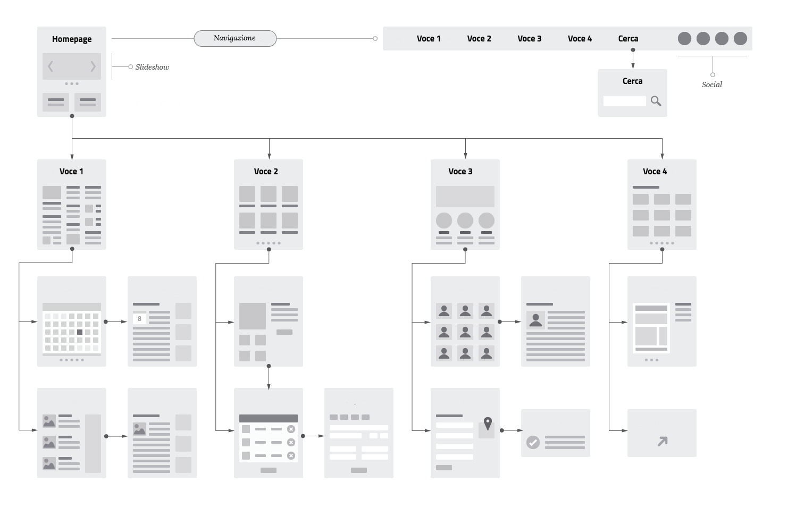

================================================================================
Principi
================================================================================

.. include:: /banner.rst

Progettiamo Servizi, non interfacce
================================================================================

Lo scopo primario dell’interfaccia di un servizio è quello di aiutare l’utente a raggiungere ciò che cerca in modo naturale ed immediato, in modo quasi **trasparente**. Per questo, la **coerenza** dei vari elementi che la compongono, anche su diversi dispositivi, è un elemento fondante per la creazione di prodotti funzionali e semplici da usare.

Un altro punto cardine di una buona interfaccia è la sua **inclusività** e la **tolleranza agli errori**: non ci si deve aspettare che l’utente abbia sempre chiaro ciò che vuole, sappia comprendere appieno eventuali istruzioni, o che sia in grado di decifrare colori ed elementi d’interfaccia non familiari.

In quest’ambito, il designer ha lo scopo di progettare interfacce che sappiano **accompagnare** il cittadino nel percorso di ricerca del servizio, correggendo eventuali errori e prevedendo diverse modalità di utilizzo da parte di utenti ad esempio con disabilità fisiche, con difficoltà di comprensione tecnologica, o che utilizzano dispositivi per l’accesso ai servizi con limitate capacità o scarsa connettività.

In questa parte delle linee guida ci concentriamo sugli elementi più classici della costruzione d’interfaccia, partendo da un prototipo grezzo fino ad arrivare ad un sito o ad una app funzionante e pronta per essere usata da chiunque.

Il modello di un’interfaccia
--------------------------------------------------------------------------------

Il livello di dettaglio più basso viene definito attraverso la creazione di un modello (chiamato anche prototipo o, in inglese *wireframe*) dell’interfaccia utente, definendo una struttura di massima dell’esperienza utente durante il suo percorso nella ricerca ed utilizzo del servizio.

La realizzazione di un prototipo “a bassa fedeltà” (in inglese *lo-fi*) per un’interfaccia utente definisce:

* l’organizzazione degli elementi interattivi nello spazio disponibile sullo schermo;
* la collocazione dei blocchi di contenuto;
* la sequenza di passaggi (in inglese *workflow*) che l’utente deve fare per concludere un processo;
* le modalità di interazione o comportamento dell’utente con il prodotto.

Tutto questo viene progettato con un’attenzione agli aspetti di struttura dell’informazione e dei flussi di navigazione, senza preoccuparsi in questa fase delle soluzioni di dettaglio che definiscono le interfacce dal punto di vista "grafico". Durante questa fase infatti viene concretizzata soltanto la struttura portante del servizio e le soluzioni ipotizzate in fase di ricerca.

Questa scelta assicura che l’attenzione sia incentrata sugli aspetti fondamentali della navigazione e della struttura, nel pieno rispetto dei requisiti di progetto e dei bisogni dei cittadini da soddisfare. In questo modo si incoraggia la discussione e il confronto sulle soluzioni proposte.

    Un esempio di *wireframe*, o prototipo a "bassa fedeltà".

Nella Figura è mostrato un esempio di prototipo costruito con un programma di design, ma per costruire un *wireframe* si possono usare diversi metodi, dalla carta ai numerosi software messi a disposizione dal mercato specificatamente per questo scopo.

Altre informazioni sul processo di prototipazione e tutti i riferimenti al *wireframe kit* di Designers Italia sono disponibili nel capitolo dedicato alla prototipazione. Nel paragrafo seguente affronteremo invece i principi e le linee guida per il design delle interfacce.
